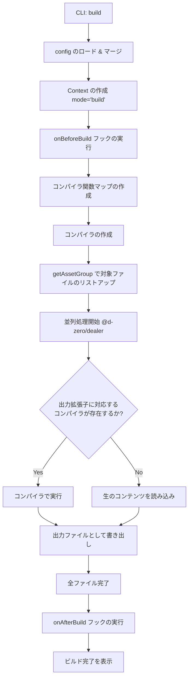
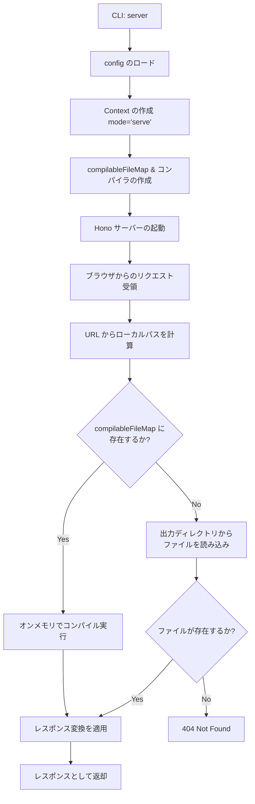

# 🏗️ Kamado 内部アーキテクチャ

Kamado は、「オンデマンドで HTML を焼き上げる」静的サイトジェネレーターです。
このドキュメントでは、Kamado の内部構造、CLI からビルド/サーバー実行までのフロー、およびプラグインシステムについて、主にコントリビューター向けに解説します。

## 核心となるコンセプト

1.  **オンデマンド・コンパイル (Dev Server)**:
    開発サーバーは、リクエストがあった瞬間に必要なファイルだけをコンパイルして返します。これにより、大規模なプロジェクトでも起動が高速です。
2.  **プラグイン・ベースのコンパイラ**:
    HTML、CSS、JavaScript などの各ファイル形式は、それぞれ独立した「コンパイラ」によって処理されます。
3.  **No Runtime**:
    生成される成果物に Kamado 独自のクライアントサイド・ランタイムは含まれません。
4.  **Config vs Context**:
    Kamado はユーザー設定（`Config`）と実行時コンテキスト（`Context`）を分離しています。`Context`型は`Config`を拡張し、CLIコマンドによって実行時に設定される`mode`フィールド（`'build' | 'serve'`）を追加します。これにより、コンパイラやフックがビルドモードか開発サーバーモードかを検出できます。

---

## Config vs Context

### Config

`Config`は`kamado.config.ts`から提供されるユーザー設定を表します。以下を含みます：

- ディレクトリ設定（`dir.input`、`dir.output`）
- 開発サーバー設定（`devServer.host`、`devServer.port`）
- Package.json情報（`pkg.production.baseURL`など）
- コンパイラプラグイン
- ライフサイクルフック

### Context

`Context`は`Config`を拡張し、実行時情報を追加します：

```typescript
export interface Context<M extends MetaData> extends Config<M> {
	readonly mode: 'serve' | 'build';
}
```

`mode`フィールドは**ユーザーが設定できません**。CLIコマンドによって自動的に設定されます：

- `kamado build` → `mode: 'build'`
- `kamado server` → `mode: 'serve'`

### モードの伝播

実行モードは以下のようにシステム全体に伝播します：

1. **CLI**（`src/cli.ts`）：ユーザーが`kamado build`または`kamado server`を実行
2. **Builder/Server**（`src/builder/build.ts`または`src/server/app.ts`）：`Config`をスプレッドして`mode`を追加し、`Context`を作成
3. **コンパイラ**：`Config`ではなく`Context`を受け取り、実行モードを検出可能
4. **フック**：ライフサイクルフック（`onBeforeBuild`、`onAfterBuild`）とpage compilerのtransform関数が`TransformContext`経由で実行モードを受け取る

このアーキテクチャにより、以下のようなモード固有の動作が可能になります：

- 開発サーバーモードでは開発サーバーURLを使用、ビルドモードでは本番URLを使用
- フックでの異なるDOM操作動作
- 実行コンテキストに基づく条件付き処理

---

## ディレクトリ構造

`packages/kamado/src` 配下の主要なディレクトリとその役割です。

- **`cli.ts`**: CLI のエントリポイント。`@d-zero/roar` を使用してコマンドを処理します。
- **`builder/`**: 静的ビルド（`kamado build`）の実行ロジック。
- **`server/`**: 開発サーバー（`kamado server`）のロジック。Hono を使用。
- **`compiler/`**: コンパイラ・プラグインのインターフェースと、機能マップの管理。
- **`config/`**: 設定ファイルのロードとマージ、デフォルト値の定義、`defineConfig()`ヘルパーの提供。
- **`data/`**: コンパイル対象ファイルのリストアップ、アセットグループの管理。
- **`deprecated/`**: 非推奨の内部ユーティリティ（エクスポートされません）。後方互換性のための旧コード。
- **`files/`**: ファイル読み込み、Frontmatter 処理、キャッシュ管理などのファイル抽象レイヤー。
- **`path/`**: パス解決ユーティリティ。
- **`stdout/`**: コンソール出力のカラーリングやフォーマット。

### コード構成の原則

コードベースは保守性のために厳格なアーキテクチャルールに従っています：

1. **1関数1ファイル**: 各TypeScriptファイル（テストファイルを除く）は、正確に1つのパブリック関数のみをエクスポートします。これにより、明確な責任範囲と容易なナビゲーションが保証されます。

2. **型定義の分離**: 型定義は各ディレクトリカテゴリ内の`types.ts`ファイルに集約されます：
   - `compiler/types.ts`: すべてのコンパイラ関連インターフェース
   - `config/types.ts`: 設定関連の型
   - `data/types.ts`: データ関連の型
   - `files/types.ts`: ファイル関連の型
   - `path/types.ts`: パス関連の型

3. **Indexファイルの廃止**: `index.ts`ファイルは使用されません。代わりに、各モジュールには具体的な名前のエントリファイル（例: `compiler/compiler.ts`、`data/data.ts`、`config/config.ts`）があり、モジュールのパブリックAPIを再エクスポートします。外部パッケージはパッケージ固有のエントリファイル（例: `page-compiler.ts`、`script-compiler.ts`）を使用します

4. **命名規則**: 関数ファイルは、エクスポートする関数名をケバブケースで命名します（例: `get-config.ts`は`getConfig`をエクスポート、`create-compiler.ts`は`createCompiler`をエクスポート）。モジュールのエントリファイルは、モジュール名自体で命名されます（例: コンパイラモジュールの`compiler.ts`、ページコンパイラパッケージの`page-compiler.ts`）

この構造により、コードの発見可能性が確保され、循環依存が防止され、関心の明確な分離が維持されます。

### 5. 関数シグネチャパターン

2個以上の必須パラメータを持つ関数は、context+optionsパターンに従う必要があります：

```typescript
/**
 * @param context - 必須の依存関係やコンテキスト（Required）
 * @param options - 任意の設定やパラメータ（Partial、オプション）
 */
export function functionName(
	context: Required<ContextType>,
	options?: Partial<OptionsType>,
): Promise<ReturnType>;
```

**例外ケース** - 以下の場合はこのパターンを適用**しない**：

1. **必須パラメータが1個のみの場合**: パラメータを直接使用

   ```typescript
   // ✅ 良い例
   export function filePathColorizer(rootDir: string, options?: Options);

   // ❌ 悪い例
   export function filePathColorizer(context: { rootDir: string }, options?: Options);
   ```

2. **すべてのパラメータがoptionalの場合**: 単一パラメータのまま維持

   ```typescript
   // ✅ 良い例
   export function build(config?: BuildConfig);

   // ❌ 悪い例
   export function build(context: {}, options?: BuildConfig);
   ```

3. **公開API/builder関数**: 一貫性よりも使いやすさを優先
   - 例: `createPageCompiler()(options)`、`createScriptCompiler()(options)`

4. **プリミティブを受け取る関数**: オブジェクト化しない
   - すでにオブジェクトを受け取る → context+optionsに分割
   - プリミティブを受け取る → そのまま維持

**判断基準**:

- 必須パラメータが2個以上 → パターンを適用
- すべてoptional → 適用しない
- 公開API → 適用しない（内部APIのみ）
- すでにオブジェクトを受け取る → 分割
- プリミティブを受け取る → そのまま維持

**例**:

```typescript
// ✅ 良い例: 3個の必須パラメータ
export function getAssetGroup(
	context: { inputDir: string; outputDir: string; compilerEntry: Compiler },
	options?: { glob?: string },
);

// ✅ 良い例: 1個の必須パラメータ
export function imageSizes(elements: Element[], options?: ImageSizesOptions);

// ❌ 悪い例: 単一パラメータをラップ
export function imageSizes(context: { elements: Element[] }, options?: ImageSizesOptions);
```

---

## 実行フロー

### 1. ビルド・フロー (`kamado build`)

全てのファイルを一括でコンパイルし、静的ファイルとして出力するフローです。



### 2. 開発サーバー・フロー (`kamado server`)

ローカル開発時のオンデマンド・コンパイルのフローです。



### CompilableFileMap

`compilableFileMap` は、キーが**出力ファイルパス**（出力ディレクトリ内の出力先パス）、値が対応するソースファイルオブジェクトの `Map<string, CompilableFile>` です。以下の手順で作成されます：

1. 設定内のすべてのコンパイラエントリを反復処理
2. 各コンパイラについて、`getAssetGroup()` を使用してコンパイラの `files` パターンに一致するファイルを収集（`ignore` に一致するものを除外）
3. 各ファイルの `outputPath`（出力先パス）を `CompilableFile` オブジェクトにマッピング

このマップにより、開発サーバーは以下を実現できます：

- リクエストが出力パスと一致した場合、ソースファイルを迅速に検索
- 出力拡張子に基づいて使用するコンパイラを特定
- ファイル変更を監視せずにオンデマンドコンパイルを実行

マップはサーバー起動時に一度構築され、その後のすべてのリクエストで使用されます。

---

## API と拡張性

### コンパイラ・プラグイン

Kamado の機能拡張は、コンパイラプラグインを追加することで行います。すべてのコンパイラ関連型は、型安全なカスタムメタデータのためにジェネリック `M extends MetaData` 型パラメータを受け取ります。

#### ジェネリック型パラメータ (`M extends MetaData`)

型パラメータ `M` は型システム全体を通じて伝搬します：

```
defineConfig<M>() → Config<M> → Context<M> → TransformContext<M>
                                            → PageData<M>
                                            → CompileData<M> → NavNode<M>
```

**デフォルト値を持つ型 (`= MetaData`):**

型注釈で直接書くユーザー向け型にはデフォルトがあります：`Config`、`Context`、`UserConfig`、`Transform`、`TransformContext`、`PageData`、`GlobalData`。カスタムメタデータが不要なユーザーは `Config<MetaData>` ではなく `Config` とそのまま書けます。

**デフォルト値を持たない型:**

コンパイラ関連型（`CustomCompiler`、`CustomCompilerPlugin`、`CustomCompilerWithMetadata`、`CompilerDefine`、`CustomCompilerFactory`、`CustomCompilerFactoryResult`、`Compilers`、`CompilerContext`）とpage-compiler型（`PageCompilerOptions`、`CompileData`、`CompileHooks`、`NavNode`など）にはデフォルトがありません。これは意図的です — 3rdパーティのコンパイラ開発者が `<M>` を省略した場合、TypeScriptが暗黙的にベースの `MetaData` にフォールバックするのではなくエラーを報告し、統合時の型の不一致を防ぎます。

**関数にデフォルトが不要な理由:**

`defineConfig<M>()`や`createPageCompiler<M>()`などの関数は、引数から `M` を自動推論します。関数の型パラメータにデフォルトを追加すると、型エラーが表面化するのではなく隠蔽されてしまいます。

**`CompilerDefine` パターン:**

`compilers` コールバックは `def: CompilerDefine<M>` ヘルパーを受け取ります。`CompilerDefine<M>` はファクトリの戻り値型から `CustomCompileOptions` を推論するジェネリック関数です：

```typescript
type CompilerDefine<M extends MetaData> = <CustomCompileOptions>(
	factory: CustomCompilerFactory<M, CustomCompileOptions>,
	options?: CustomCompileOptions,
) => CustomCompilerWithMetadata<M>;
```

この2段階のジェネリクス（`M` はconfigから、`CustomCompileOptions` はファクトリから）により、各 `def()` 呼び出しで手動の型注釈なしに完全な型推論が得られます。

#### コンパイラ設定 (`Compilers<M>`)

`Config.compilers` フィールドは、型安全なコンパイラ定義のためにコールバック形式を使用します：

```typescript
export interface Compilers<M extends MetaData> {
	(define: CompilerDefine<M>): readonly CustomCompilerWithMetadata<M>[];
}

export type CompilerDefine<M extends MetaData> = <CustomCompileOptions>(
	factory: CustomCompilerFactory<M, CustomCompileOptions>,
	options?: CustomCompileOptions,
) => CustomCompilerWithMetadata<M>;

export type CustomCompilerFactory<M extends MetaData, CustomCompileOptions> = (
	options?: CustomCompileOptions,
) => CustomCompilerWithMetadata<M>;
```

コールバックはオプションをバインドする `define` ヘルパーを受け取ります。`M` 型パラメータは `defineConfig<M>` からコールバックを通じてフローし、各コンパイラのオプションの完全な型推論を可能にします。

実行時には、`createCompileFunctions()`（`src/compiler/compile-functions.ts`）が `factory(options)` を呼び出すヘルパーを渡してコールバックを解決します。

#### コンパイラインターフェース

```typescript
// CustomCompilerインターフェースはContextを受け取る
export interface CustomCompiler<M extends MetaData> {
	(context: Context<M>): Promise<CustomCompileFunction> | CustomCompileFunction;
}

// CustomCompileFunctionは個別のファイルコンパイルを処理
export interface CustomCompileFunction {
	(
		compilableFile: CompilableFile,
		compile: CompileFunction,
		log?: (message: string) => void,
		cache?: boolean,
	): Promise<string | ArrayBuffer> | string | ArrayBuffer;
}
```

`CustomCompiler`は`Context<M>`オブジェクト（`mode: 'serve' | 'build'`を含む）を受け取り、`CustomCompileFunction`を返します。`CustomCompileFunction`は以下のパラメータを受け取ります：

- `compilableFile`: コンパイル対象のファイル
- `compile`: コンパイル中に他のファイルを再帰的にコンパイルできる関数（レイアウトやインクルードなど）
- `log`: オプションのログ出力関数
- `cache`: ファイルコンテンツをキャッシュするかどうか

ソースコードの読み込みやキャッシュの管理は`CompilableFile`クラス（`src/files/`）が隠蔽します。`compile`パラメータにより、コンパイラは依存ファイルを再帰的にコンパイルできます。

**注意**: `Context`は`Config`を拡張しているため、パラメータ名として`Config`を使用している既存のカスタムコンパイラは変更なしで動作し続けます。ただし、`context.mode`にアクセスして実行モードを検出できます。

### ページリストフック

`pageList`フックは、テンプレートで利用可能なページリストをフィルターまたは変換できます。グローバルデータ収集時（`getGlobalData()`内）に呼び出され、ページテンプレートで利用可能な`pageList`変数に影響します。

```typescript
pageList?: (
	pageAssetFiles: readonly CompilableFile[],
	config: Config<M>,
) => PageData<M>[] | Promise<PageData<M>[]>;
```

`PageData<M>`は`CompilableFile`を拡張しオプションの`metaData`を持ちます：

```typescript
interface PageData<M extends MetaData> extends CompilableFile {
	metaData?: M;
}
```

**パラメータ:**

- `pageAssetFiles`: 全てのページファイルの配列（ページコンパイラの`files`パターンにマッチするファイル）
- `config`: 設定オブジェクト

**戻り値:** フィルター/変換された`PageData<M>`オブジェクトの配列

**注記:** `pageList`フック時点では、`metaData`はまだフロントマターから展開されていません。パンくずリストやナビゲーションでタイトルが必要な場合は、このフック内で明示的に`metaData.title`を設定してください。

**ユースケース:**

- 下書きや未公開ページをナビゲーションから除外
- 日付やカスタム順序でページをソート
- ページにカスタムメタデータ（`metaData.title`など）を追加
- カテゴリやタグでページをフィルタリング

**例:**

```typescript
// kamado.config.ts
import { defineConfig } from 'kamado/config';

export default defineConfig({
	pageList: async (pages, config) => {
		// アンダースコアで始まるページ（下書き）を除外
		return pages.filter((page) => !page.inputPath.includes('/_'));
	},
});
```

### ライフサイクルフック

ユーザーは `kamado.config.ts` を通じてビルドの前後に任意の処理を挿入できます。

- `onBeforeBuild(context: Context<M>)`: ビルド開始前に実行（アセットの事前準備など）。`mode`フィールドを持つ`Context`を受け取ります。
- `onAfterBuild(context: Context<M>)`: ビルド完了後に実行（サイトマップ生成、通知など）。`mode`フィールドを持つ`Context`を受け取ります。

両方のフックは`Config`ではなく`Context`を受け取るため、ビルドモードか開発サーバーモードかを検出できます。

### レスポンス変換API

レスポンス変換APIは、開発サーバーモード（`serve`モードのみ）でレスポンスコンテンツを変更できます。`src/server/transform.ts`に実装され、`src/server/route.ts`のリクエスト処理フローに統合されています。

**注記:** レスポンス変換API（`devServer.transforms`）とpage compilerのTransform Pipeline API（`createPageCompiler()({ transforms })`）は、どちらも`kamado/config`の同じ`Transform`インターフェースを使用します。ただし、適用範囲が異なります：

- レスポンス変換は開発モードのみで全てのファイルタイプに適用され、`filter`オプションが有効です
- ページ変換はビルドモードと開発モードの両方でHTMLページに適用され、`filter`オプションは無視されます

ページ変換システムについては`@kamado-io/page-compiler`を参照してください。`createDefaultPageTransforms()`は`packages/@kamado-io/page-compiler/src/page-transform.ts`からエクスポートされています。

#### アーキテクチャ

```typescript
// 変換インターフェース
export interface Transform<M extends MetaData> {
	readonly name: string;
	readonly filter?: {
		readonly include?: string | readonly string[];
		readonly exclude?: string | readonly string[];
	};
	readonly transform: (
		content: string | ArrayBuffer,
		context: TransformContext<M>,
	) => Promise<string | ArrayBuffer> | string | ArrayBuffer;
}

// 変換コンテキストはリクエスト/レスポンス情報を提供
export interface TransformContext<M extends MetaData> {
	readonly path: string; // リクエストパス（出力ディレクトリからの相対パス）
	readonly filePath: string; // ファイルパス（pathのエイリアス）
	readonly inputPath?: string; // ソースファイルパス（コンパイラから利用可能な場合）
	readonly outputPath: string; // 出力ファイルパス
	readonly outputDir: string; // 出力ディレクトリパス
	readonly isServe: boolean; // 開発サーバーモードで実行中かどうか
	readonly context: Context<M>; // 完全な実行コンテキスト（config + mode）
	readonly compile: CompileFunction; // 他のファイルをコンパイルする関数
}
```

#### 実行フロー

1. **モードチェック**: `devServer.transforms`の場合は`serve`モードでのみ実行（`applyTransforms()`でチェック）
2. **フィルタマッチング**: 各変換に対してpicomatchを使用したパスパターン（Globパターンマッチング）をチェック
3. **順次実行**: 変換は配列の順序で適用
4. **エラーハンドリング**: エラーはログに記録されますがサーバーを停止させません。エラー時は元のコンテンツが返されます

**注記**: Transform utilities（`injectToHead`、`createSSIShim`）は、page compilerのカスタムtransformまたは`manipulateDOM()`のhookオプション内で手動で呼び出すことで、serveモードとbuildモードの両方で使用できます。

#### 実装の詳細

**場所**: `src/server/transform.ts`

主要な関数:

- `applyTransforms(content, context, transforms)`: メインの実行エンジン
- `shouldApplyTransform(transform, context)`: フィルタマッチングロジック

**統合**: `src/server/route.ts`

変換は、リクエストハンドラの2箇所で適用されます：

1. `compilableFileMap`でマッチしたファイルのコンパイル後
2. 出力ディレクトリから静的ファイルを読み込んだ後

ヘルパー関数`respondWithTransform()`が変換適用ロジックを集約しています。

#### パフォーマンス特性

- **最小限のオーバーヘッド**: 変換が設定されている場合のみ実行
- **ストリーミング互換**: stringとArrayBufferの両方のコンテンツに対応
- **ノンブロッキング**: `Promise.resolve()`経由で非同期変換をサポート
- **フェイルセーフ**: 個別の変換エラーが他の変換やサーバーに影響しない

#### ユースケース

- **開発ツール**: ライブリロードスクリプト、デバッグパネルの挿入
- **疑似SSI**: 開発用のサーバーサイドインクルード
- **ヘッダー挿入**: メタタグ、CSPヘッダー（コメントとして）の追加
- **ソースマッピング**: コンパイル済み出力にソースファイルコメントを追加
- **モックデータ**: APIレスポンスにテストデータを挿入

**注意**: このAPIは意図的に開発専用です。本番用の変換には、page compilerのTransform Pipeline（`transforms`オプションに`manipulateDOM()`、`characterEntities()`、`prettier()`などのtransform factoryを設定）またはビルド時処理を使用してください。

---

## 主要な依存ライブラリ

- **[@d-zero/dealer](https://www.npmjs.com/package/@d-zero/dealer)**: 全体の並列処理とプログレス表示を制御。
- **[@d-zero/roar](https://www.npmjs.com/package/@d-zero/roar)**: CLI のコマンド・オプション解析。
- **[Hono](https://hono.dev/)**: 高速な開発サーバーのベース。
- **[cosmiconfig](https://github.com/cosmiconfig/cosmiconfig)**: 設定ファイルの探索。
