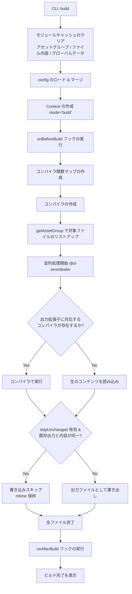
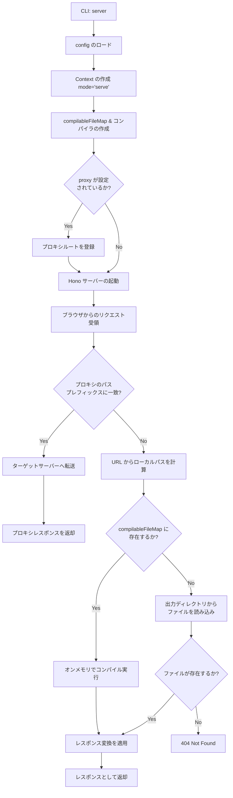

# 🏗️ Kamado 内部アーキテクチャ

Kamado は、「オンデマンドで HTML を焼き上げる」静的サイトジェネレーターです。
このドキュメントでは、Kamado の内部構造、CLI からビルド/サーバー実行までのフロー、およびプラグインシステムについて、主にコントリビューター向けに解説します。

## 核心となるコンセプト

1.  **オンデマンド・コンパイル (Dev Server)**:
    開発サーバーは、リクエストがあった瞬間に必要なファイルだけをコンパイルして返します。これにより、大規模なプロジェクトでも起動が高速です。
2.  **プラグイン・ベースのコンパイラ**:
    HTML、CSS、JavaScript などの各ファイル形式は、それぞれ独立した「コンパイラ」によって処理されます。
3.  **No Runtime**:
    生成される成果物に Kamado 独自のクライアントサイド・ランタイムは含まれません。
4.  **Config vs Context**:
    Kamado はユーザー設定（`Config`）と実行時コンテキスト（`Context`）を分離しています。`Context`型は`Config`を拡張し、CLIコマンドによって実行時に設定される`mode`フィールド（`'build' | 'serve'`）を追加します。これにより、コンパイラやフックがビルドモードか開発サーバーモードかを検出できます。

---

## Config vs Context

### Config

`Config`は`kamado.config.ts`から提供されるユーザー設定を表します。以下を含みます：

- ディレクトリ設定（`dir.input`、`dir.output`）
- 開発サーバー設定（`devServer.host`、`devServer.port`）
- Package.json情報（`pkg.production.baseURL`など）
- コンパイラプラグイン
- ライフサイクルフック

### Context

`Context`は`Config`を拡張し、実行時情報を追加します：

```typescript
export interface Context<M extends MetaData> extends Config<M> {
	readonly mode: 'serve' | 'build';
}
```

`mode`フィールドは**ユーザーが設定できません**。CLIコマンドによって自動的に設定されます：

- `kamado build` → `mode: 'build'`
- `kamado server` → `mode: 'serve'`

### モードの伝播

実行モードは以下のようにシステム全体に伝播します：

1. **CLI**（`src/cli.ts`）：ユーザーが`kamado build`または`kamado server`を実行
2. **Builder/Server**（`src/builder/build.ts`または`src/server/app.ts`）：`Config`をスプレッドして`mode`を追加し、`Context`を作成
3. **コンパイラ**：`Config`ではなく`Context`を受け取り、実行モードを検出可能
4. **フック**：ライフサイクルフック（`onBeforeBuild`、`onAfterBuild`）とpage compilerのtransform関数が`TransformContext`経由で実行モードを受け取る

このアーキテクチャにより、以下のようなモード固有の動作が可能になります：

- 開発サーバーモードでは開発サーバーURLを使用、ビルドモードでは本番URLを使用
- フックでの異なるDOM操作動作
- 実行コンテキストに基づく条件付き処理

---

## ディレクトリ構造

`packages/kamado/src` 配下の主要なディレクトリとその役割です。

- **`cli.ts`**: CLI のエントリポイント。`@d-zero/roar` を使用してコマンドを処理します。
- **`builder/`**: 静的ビルド（`kamado build`）の実行ロジック。
- **`server/`**: 開発サーバー（`kamado server`）のロジック。Hono を使用。プロキシ転送（`proxy.ts`）、レスポンス変換（`transform.ts`）、ルートハンドリング（`route.ts`）を含む。
- **`compiler/`**: コンパイラ・プラグインのインターフェースと、機能マップの管理。
- **`config/`**: 設定ファイルのロードとマージ、デフォルト値の定義、`defineConfig()`ヘルパーの提供。
- **`data/`**: コンパイル対象ファイルのリストアップ、アセットグループの管理。
- **`deprecated/`**: 非推奨の内部ユーティリティ（エクスポートされません）。後方互換性のための旧コード。
- **`files/`**: ファイル読み込み、Frontmatter 処理、キャッシュ管理などのファイル抽象レイヤー。
- **`path/`**: パス解決ユーティリティ。
- **`stdout/`**: コンソール出力のカラーリングやフォーマット。

### コード構成の原則

コードベースは保守性のために厳格なアーキテクチャルールに従っています：

1. **1関数1ファイル**: 各TypeScriptファイル（テストファイルを除く）は、正確に1つのパブリック関数のみをエクスポートします。これにより、明確な責任範囲と容易なナビゲーションが保証されます。

2. **型定義の分離**: 型定義は各ディレクトリカテゴリ内の`types.ts`ファイルに集約されます：
   - `compiler/types.ts`: すべてのコンパイラ関連インターフェース
   - `config/types.ts`: 設定関連の型
   - `data/types.ts`: データ関連の型
   - `files/types.ts`: ファイル関連の型
   - `path/types.ts`: パス関連の型

3. **Indexファイルの廃止**: `index.ts`ファイルは使用されません。代わりに、各モジュールには具体的な名前のエントリファイル（例: `compiler/compiler.ts`、`data/data.ts`、`config/config.ts`）があり、モジュールのパブリックAPIを再エクスポートします。外部パッケージはパッケージ固有のエントリファイル（例: `page-compiler.ts`、`script-compiler.ts`）を使用します

4. **命名規則**: 関数ファイルは、エクスポートする関数名をケバブケースで命名します（例: `get-config.ts`は`getConfig`をエクスポート、`create-compiler.ts`は`createCompiler`をエクスポート）。モジュールのエントリファイルは、モジュール名自体で命名されます（例: コンパイラモジュールの`compiler.ts`、ページコンパイラパッケージの`page-compiler.ts`）

この構造により、コードの発見可能性が確保され、循環依存が防止され、関心の明確な分離が維持されます。

### 5. 関数シグネチャパターン

2個以上の必須パラメータを持つ関数は、context+optionsパターンに従う必要があります：

```typescript
/**
 * @param context - 必須の依存関係やコンテキスト（Required）
 * @param options - 任意の設定やパラメータ（Partial、オプション）
 */
export function functionName(
	context: Required<ContextType>,
	options?: Partial<OptionsType>,
): Promise<ReturnType>;
```

**例外ケース** - 以下の場合はこのパターンを適用**しない**：

1. **必須パラメータが1個のみの場合**: パラメータを直接使用

   ```typescript
   // ✅ 良い例
   export function filePathColorizer(rootDir: string, options?: Options);

   // ❌ 悪い例
   export function filePathColorizer(context: { rootDir: string }, options?: Options);
   ```

2. **すべてのパラメータがoptionalの場合**: 単一パラメータのまま維持

   ```typescript
   // ✅ 良い例
   export function build(config?: BuildConfig);

   // ❌ 悪い例
   export function build(context: {}, options?: BuildConfig);
   ```

3. **公開API/builder関数**: 一貫性よりも使いやすさを優先
   - 例: `createPageCompiler()(options)`、`createScriptCompiler()(options)`

4. **プリミティブを受け取る関数**: オブジェクト化しない
   - すでにオブジェクトを受け取る → context+optionsに分割
   - プリミティブを受け取る → そのまま維持

**判断基準**:

- 必須パラメータが2個以上 → パターンを適用
- すべてoptional → 適用しない
- 公開API → 適用しない（内部APIのみ）
- すでにオブジェクトを受け取る → 分割
- プリミティブを受け取る → そのまま維持

**例**:

```typescript
// ✅ 良い例: 3個の必須パラメータ
export function getAssetGroup(
	context: { inputDir: string; outputDir: string; compilerEntry: Compiler },
	options?: { glob?: string },
);

// ✅ 良い例: 1個の必須パラメータ
export function imageSizes(elements: Element[], options?: ImageSizesOptions);

// ❌ 悪い例: 単一パラメータをラップ
export function imageSizes(context: { elements: Element[] }, options?: ImageSizesOptions);
```

---

## 実行フロー

### 1. ビルド・フロー (`kamado build`)

全てのファイルを一括でコンパイルし、静的ファイルとして出力するフローです。


```mermaid
graph TD
    A[CLI: build] --> A2[モジュールキャッシュのクリア<br>アセットグループ / ファイル内容 / グローバルデータ]
    A2 --> B[config のロード & マージ]
    B --> B2[Context の作成 mode='build']
    B2 --> C[onBeforeBuild フックの実行]
    C --> D[コンパイラ関数マップの作成]
    D --> D2[コンパイラの作成]
    D2 --> E[getAssetGroup で対象ファイルのリストアップ]
    E --> F[並列処理開始 @d-zero/dealer]
    F --> G{出力拡張子に対応する<br>コンパイラが存在するか?}
    G -- Yes --> H[コンパイラで実行]
    G -- No --> I[生のコンテンツを読み込み]
    H --> J{skipUnchanged 有効 &<br>既存出力と内容が同一?}
    I --> J
    J -- Yes --> J2[書き込みスキップ<br>mtime 保持]
    J -- No --> J3[出力ファイルとして書き出し]
    J2 --> K[全ファイル完了]
    J3 --> K
    K --> L[onAfterBuild フックの実行]
    L --> M[ビルド完了を表示]
```

`build()` は毎回クリーンな状態から開始します。最初にモジュールレベルのキャッシュ（アセットグループのメモ化、ファイル内容、グローバルデータ）をクリアするため、同一プロセスで連続してビルドしてもソースの編集が必ず反映されます。出力ディレクトリの作成はビルド内で重複排除されます。`skipUnchanged` ビルドオプション（`kamado build --skip-unchanged`）を有効にすると、内容が変わっていない出力は書き込まれません。その際はまずファイルサイズ（`stat`）を比較します。一致した場合のみ内容を比較し、同一なら既存ファイルの mtime を保持します。

#### インクリメンタルビルド（`--incremental`）

`kamado build --incremental` を指定すると、出力ごとに**検証トレース**を `.kamado/cache/build-manifest.json`（`src/builder/build-manifest.ts`）へ永続化します。トレースの内容は、入力パス・コンパイルが読み取った全ファイルの SHA-256・環境ダイジェスト・出力のバイト長です。次のインクリメンタルビルドでは、環境ダイジェスト・入力パス・全依存ハッシュ・出力サイズがすべて一致するファイルを完全にスキップします（コンパイラ自体が実行されず `Cached` と表示）。1つでも不一致なら通常どおりコンパイルし、新しいトレースを記録します。依存集合そのものが変わる変更もその再ビルドで取り込まれます（verifying trace の古典的な性質です）。

依存の発見は2層構造です。

- **コアの読み取り追跡** — `build()` は各コンパイルを `collectDependencies()`（`src/files/dependency-tracker.ts`、`AsyncLocalStorage` スコープ）でラップします。スコープ内の `getFileContent()` 呼び出しがパスを記録するため、ページ本体・sidecar JSON（存在しない sidecar の探索も含む — 後から作成すると無効化されます）・レイアウトファイルが自動的にカバーされます。スコープ外ではトラッカーは no-op のため、開発サーバーにコストはかかりません。
- **コンパイラによる報告** — kamado のファイル API の外で解決されるものは `trackDependency()` で明示的に報告されます。pug の include/extends（コンパイル済みテンプレートの `dependencies` リスト）、esbuild の `metafile.inputs`、postcss の `dependency` メッセージ（`@import`）です。

**環境ダイジェスト**は、そのコンパイラの全ファイルに影響するコンテキストレベルの入力をカバーします。各 compile 関数はオプションの `cacheDigest()` プロパティを公開できます（page-compiler はグローバルデータとページリストをダイジェスト化 — ビルド時刻である `date` は除外し、関数は `stableSerialize()` が省略します。style/script コンパイラはオプションと解決済みバナーをダイジェスト化します）。さらに CLI が設定パスを渡す場合、`build()` が設定ファイルの内容ハッシュを合成します。ページ間の依存（nav・パンくず）はページリストを経由するため、`config.pageList` に現れる frontmatter の変更は全ページを再ビルドし、本文だけの編集はそのページだけを再ビルドします。

安全側の境界は次のとおりです。依存が1つも記録されていないエントリはスキップされません（ファイルシステムを直接読むカスタムコンパイラには検証対象がないため）。`BUILD_MANIFEST_VERSION` が異なる、またはパースできないマニフェストは無視され、単にフルビルドになります。設定ファイル外のユーザー関数内に隠れた振る舞いの変更は `.kamado/cache/` の削除が必要です（README に記載）。

### 2. 開発サーバー・フロー (`kamado server`)

ローカル開発時のオンデマンド・コンパイルのフローです。


```mermaid
graph TD
    A[CLI: server] --> B[config のロード]
    B --> B2[Context の作成 mode='serve']
    B2 --> C[compilableFileMap & コンパイラの作成]
    C --> C1{proxy が設定<br>されているか?}
    C1 -- Yes --> C1a[プロキシルートを登録]
    C1a --> C2[Hono サーバーの起動]
    C1 -- No --> C2
    C2 --> D[ブラウザからのリクエスト受領]
    D --> D1{プロキシのパス<br>プレフィックスに一致?}
    D1 -- Yes --> D2[ターゲットサーバーへ転送]
    D2 --> D3[プロキシレスポンスを返却]
    D1 -- No --> E[URL からローカルパスを計算]
    E --> F{compilableFileMap に<br>存在するか?}
    F -- Yes --> H[オンメモリでコンパイル実行]
    H --> I[レスポンス変換を適用]
    I --> J[レスポンスとして返却]
    F -- No --> K[出力ディレクトリから<br>ファイルを読み込み]
    K --> L{ファイルが存在するか?}
    L -- Yes --> I
    L -- No --> M[404 Not Found]
```

### CompilableFileMap

`compilableFileMap` は、キーが**出力ファイルパス**（出力ディレクトリ内の出力先パス）、値が対応するソースファイルオブジェクトの `Map<string, CompilableFile>` です。以下の手順で作成されます：

1. 設定内のすべてのコンパイラエントリを反復処理
2. 各コンパイラについて、`getAssetGroup()` を使用してコンパイラの `files` パターンに一致するファイルを収集（`ignore` に一致するものを除外）
3. 各ファイルの `outputPath`（出力先パス）を `CompilableFile` オブジェクトにマッピング

このマップにより、開発サーバーは以下を実現できます：

- リクエストが出力パスと一致した場合、ソースファイルを迅速に検索
- 出力拡張子に基づいて使用するコンパイラを特定
- ファイル変更を監視せずにオンデマンドコンパイルを実行

マップはサーバー起動時に一度構築され、その後のすべてのリクエストで使用されます。

### `outputPathField` による出力先上書き

コンパイラエントリは `CustomCompilerWithMetadata` に `outputPathField: '<フィールド名>'` を設定する（あるいはユーザー向けオプションから設定する）ことで、frontmatter 駆動の出力先上書きにオプトインできます。ファクトリ結果に `defaultOutputPathField` を持たせることも可能ですが、page-compiler は意図的にこれを設定していません — 利用者が `createPageCompiler()` のオプションに `outputPathField: 'path'`（任意のフィールド名でよい）を明示することで初めて有効になります。すべてのコンパイラのデフォルトは **OFF** であり、既存プロジェクトの frontmatter キーが意図せず routing に解釈されることはありません。

フィールドが設定されている場合、`getAssetGroup()` は各ファイルの frontmatter（および同名 `.json` サイドカー）を返却前に読み込みます。指定フィールドの値が非空の文字列であれば、`resolveMetaPath()`（`packages/kamado/src/path/resolve-meta-path.ts`）で `outputPath` / `url` / `filePathStem` / `fileSlug` を上書きパスから再計算します。文字列以外の値（数値・配列・オブジェクト・null など）は無視されます。

許容形式は3種類です。`/foo/bar.html`（そのまま使用）、`/foo/bar`（コンパイラの `outputExtension` を補完）、`/foo/bar/`（ディレクトリ扱い → `index<outputExtension>` を補完）。`.` と `..` の両セグメントは拒否され、最終ガードとして `dir.output` 外に解決されるパスも拒否します。

複数のソースが同一の出力パスに解決された場合の挙動は、コンパイラエントリの `outputPathConflict` 設定で切り替えます。`'error'`（throw）、`'warning'`（デフォルト — `stderr` に警告を出して勝者を残す）、`'silent'`（ログなしで勝者を残す）の3値を取ります。勝者判定のルールは2段階で、まず **frontmatter による上書きを持つファイルがデフォルト計算パスのファイルに優先** し、同等の場合は **先勝ち** です。`getAssetGroup()` 内の `seen` Map で出力パスを追跡し、置換が起きても返却される `CompilableFile[]` の位置は最初に観測したファイルの位置を保持するため、処理順に依存しない結果になります。

先読みは `files/file-content.ts` のモジュールレベルキャッシュを温めるため、build の後段の `getContentFromFile`（`cache=true`）はディスク再読込を行いません。さらに `getAssetGroup()` の結果自体も列挙の値入力をキーにメモ化される（毎ビルド開始時にクリア）ため、`build()` と `getGlobalData()` の両方から同じコンパイラエントリが列挙されても glob + frontmatter の走査は1回で済みます。dev server は編集を反映するためリクエスト毎に `cache=false` を渡すので、先読みコストは起動時の1回のみ支払われます。上書きは `getAssetGroup` が返す `CompilableFile` に既に反映されているため、`compilableFileMap`（dev server）と `build()`（`file.outputPath` に書き出し）はどちらも追加変更なしで上書きを尊重します。

---

## API と拡張性

### コンパイラ・プラグイン

Kamado の機能拡張は、コンパイラプラグインを追加することで行います。すべてのコンパイラ関連型は、型安全なカスタムメタデータのためにジェネリック `M extends MetaData` 型パラメータを受け取ります。

#### `MetaData` ベースインターフェース

`MetaData` はページメタデータの空のベースインターフェース（`{}`）です。任意のユーザー定義 `interface` や `type` が `extends MetaData` 制約を満たします。

#### `Config<M>` の不変性（Invariance）

`Config<M>` は型パラメータ `M` に対して**不変（invariant）**です。これは TypeScript の型システムの固有の性質であり、`M` が共変位置と反変位置の両方に現れるため避けることができません。

**反変位置**（`M` が入力として流れるコールバック引数）：

- `pageList: (pageAssetFiles, config: Config<M>) => PageData<M>[]`
- `onBeforeBuild: (context: Context<M>) => ...`
- `onAfterBuild: (context: Context<M>) => ...`
- `compilers: (def: CompilerDefine<M>) => ...`
- `devServer.transforms[].transform: (content, context: TransformContext<M>) => ...`

**共変位置**（`M` が出力として流れる戻り値型）：

- `pageList: (...) => PageData<M>[]`

さらに、`Context<M> extends Config<M>` が再帰的な不変性チェーンを形成します。

**結果:** `Config<PageMetaData>` は `Config<MetaData>` に**決して代入できません**（逆も同様）。`Config` を受け取る関数はジェネリックにする必要があります：

```typescript
// ✅ 良い例 — 任意のメタデータ型で動作
function helper<M extends MetaData>(config: Config<M>) { ... }

// ❌ 悪い例 — Config<PageMetaData> は Config<MetaData> に代入できない
function helper(config: Config<MetaData>) { ... }
```

#### ジェネリック型パラメータ (`M extends MetaData`)

型パラメータ `M` は型システム全体を通じて伝搬します：

```
defineConfig<M>() → Config<M> → Context<M> → TransformContext<M>
                                            → PageData<M>
                                            → CompileData<M> → NavNode<M>
```

**デフォルト値を持つ型 (`= MetaData`):**

型注釈で直接書くユーザー向け型にはデフォルトがあります：`Config`、`Context`、`UserConfig`、`Transform`、`TransformContext`、`PageData`、`GlobalData`。カスタムメタデータが不要なユーザーは `Config<MetaData>` ではなく `Config` とそのまま書けます。

**デフォルト値を持たない型:**

コンパイラ関連型（`CustomCompiler`、`CustomCompilerPlugin`、`CustomCompilerWithMetadata`、`CompilerDefine`、`CustomCompilerFactory`、`CustomCompilerFactoryResult`、`Compilers`、`CompilerContext`）とpage-compiler型（`PageCompilerOptions`、`CompileData`、`CompileHooks`、`NavNode`など）にはデフォルトがありません。これは意図的です — 3rdパーティのコンパイラ開発者が `<M>` を省略した場合、TypeScriptが暗黙的にベースの `MetaData` にフォールバックするのではなくエラーを報告し、統合時の型の不一致を防ぎます。

**関数にデフォルトが不要な理由:**

`defineConfig<M>()`や`createPageCompiler<M>()`などの関数は、引数から `M` を自動推論します。関数の型パラメータにデフォルトを追加すると、型エラーが表面化するのではなく隠蔽されてしまいます。

**`CompilerDefine` パターン:**

`compilers` コールバックは `def: CompilerDefine<M>` ヘルパーを受け取ります。`CompilerDefine<M>` はファクトリの戻り値型から `CustomCompileOptions` を推論するジェネリック関数です：

```typescript
type CompilerDefine<M extends MetaData> = <CustomCompileOptions>(
	factory: CustomCompilerFactory<M, CustomCompileOptions>,
	options?: CustomCompileOptions,
) => CustomCompilerWithMetadata<M>;
```

この2段階のジェネリクス（`M` はconfigから、`CustomCompileOptions` はファクトリから）により、各 `def()` 呼び出しで手動の型注釈なしに完全な型推論が得られます。

#### コンパイラ設定 (`Compilers<M>`)

`Config.compilers` フィールドは、型安全なコンパイラ定義のためにコールバック形式を使用します：

```typescript
export interface Compilers<M extends MetaData> {
	(define: CompilerDefine<M>): readonly CustomCompilerWithMetadata<M>[];
}

export type CompilerDefine<M extends MetaData> = <CustomCompileOptions>(
	factory: CustomCompilerFactory<M, CustomCompileOptions>,
	options?: CustomCompileOptions,
) => CustomCompilerWithMetadata<M>;

export type CustomCompilerFactory<M extends MetaData, CustomCompileOptions> = (
	options?: CustomCompileOptions,
) => CustomCompilerWithMetadata<M>;
```

コールバックはオプションをバインドする `define` ヘルパーを受け取ります。`M` 型パラメータは `defineConfig<M>` からコールバックを通じてフローし、各コンパイラのオプションの完全な型推論を可能にします。

実行時には、`createCompileFunctions()`（`src/compiler/compile-functions.ts`）が `factory(options)` を呼び出すヘルパーを渡してコールバックを解決します。

#### コンパイラインターフェース

```typescript
// CustomCompilerインターフェースはContextを受け取る
export interface CustomCompiler<M extends MetaData> {
	(context: Context<M>): Promise<CustomCompileFunction> | CustomCompileFunction;
}

// CustomCompileFunctionは個別のファイルコンパイルを処理
export interface CustomCompileFunction {
	(
		compilableFile: CompilableFile,
		compile: CompileFunction,
		log?: (message: string) => void,
		cache?: boolean,
	): Promise<string | ArrayBuffer> | string | ArrayBuffer;
}
```

`CustomCompiler`は`Context<M>`オブジェクト（`mode: 'serve' | 'build'`を含む）を受け取り、`CustomCompileFunction`を返します。`CustomCompileFunction`は以下のパラメータを受け取ります：

- `compilableFile`: コンパイル対象のファイル
- `compile`: コンパイル中に他のファイルを再帰的にコンパイルできる関数（レイアウトやインクルードなど）
- `log`: オプションのログ出力関数
- `cache`: キャッシュ済みのファイル内容やコンパイル成果物（コンパイル済みテンプレート関数、プロセッサ等）を再利用してよいかどうか。dev server はファイル編集を必ず反映するためリクエストごとに `false` を渡し、`build()` は `undefined` のまま（各コンパイラはキャッシュ有効をデフォルトとする）

ソースコードの読み込みやキャッシュの管理は`CompilableFile`クラス（`src/files/`）が隠蔽します。`compile`パラメータにより、コンパイラは依存ファイルを再帰的にコンパイルできます。

**注意**: `Context`は`Config`を拡張しているため、パラメータ名として`Config`を使用している既存のカスタムコンパイラは変更なしで動作し続けます。ただし、`context.mode`にアクセスして実行モードを検出できます。

### ページリストフック

`pageList`フックは、テンプレートで利用可能なページリストをフィルターまたは変換できます。グローバルデータ収集時（`getGlobalData()`内）に呼び出され、ページテンプレートで利用可能な`pageList`変数に影響します。

```typescript
pageList?: (
	pageAssetFiles: readonly CompilableFile[],
	config: Config<M>,
) => PageData<M>[] | Promise<PageData<M>[]>;
```

`PageData<M>`は`CompilableFile`を拡張しオプションの`metaData`を持ちます：

```typescript
interface PageData<M extends MetaData> extends CompilableFile {
	metaData?: M;
}
```

**パラメータ:**

- `pageAssetFiles`: 全てのページファイルの配列（ページコンパイラの`files`パターンにマッチするファイル）
- `config`: 設定オブジェクト

**戻り値:** フィルター/変換された`PageData<M>`オブジェクトの配列

**注記:** `pageList`フック時点では、`metaData`はまだフロントマターから展開されていません。パンくずリストやナビゲーションでタイトルが必要な場合は、このフック内で明示的に`metaData.title`を設定してください。

**ユースケース:**

- 下書きや未公開ページをナビゲーションから除外
- 日付やカスタム順序でページをソート
- ページにカスタムメタデータ（`metaData.title`など）を追加
- カテゴリやタグでページをフィルタリング

**例:**

```typescript
// kamado.config.ts
import { defineConfig } from 'kamado/config';

export default defineConfig({
	pageList: async (pages, config) => {
		// アンダースコアで始まるページ（下書き）を除外
		return pages.filter((page) => !page.inputPath.includes('/_'));
	},
});
```

### ライフサイクルフック

ユーザーは `kamado.config.ts` を通じてビルドの前後に任意の処理を挿入できます。

- `onBeforeBuild(context: Context<M>)`: ビルド開始前に実行（アセットの事前準備など）。`mode`フィールドを持つ`Context`を受け取ります。
- `onAfterBuild(context: Context<M>)`: ビルド完了後に実行（サイトマップ生成、通知など）。`mode`フィールドを持つ`Context`を受け取ります。

両方のフックは`Config`ではなく`Context`を受け取るため、ビルドモードか開発サーバーモードかを検出できます。

### レスポンス変換API

レスポンス変換APIは、開発サーバーモード（`serve`モードのみ）でレスポンスコンテンツを変更できます。`src/server/transform.ts`に実装され、`src/server/route.ts`のリクエスト処理フローに統合されています。

**注記:** レスポンス変換API（`devServer.transforms`）とpage compilerのTransform Pipeline API（`createPageCompiler()({ transforms })`）は、どちらも`kamado/config`の同じ`Transform`インターフェースを使用します。ただし、適用範囲が異なります：

- レスポンス変換は開発モードのみで全てのファイルタイプに適用され、`filter`オプションが有効です
- ページ変換はビルドモードと開発モードの両方でHTMLページに適用され、`filter`オプションは無視されます

ページ変換システムについては`@kamado-io/page-compiler`を参照してください。`createDefaultPageTransforms()`は`packages/@kamado-io/page-compiler/src/page-transform.ts`からエクスポートされています。

#### アーキテクチャ

```typescript
// 変換インターフェース
export interface Transform<M extends MetaData> {
	readonly name: string;
	readonly filter?: {
		readonly include?: string | readonly string[];
		readonly exclude?: string | readonly string[];
	};
	readonly transform: (
		content: string | ArrayBuffer,
		context: TransformContext<M>,
	) => Promise<string | ArrayBuffer> | string | ArrayBuffer;
}

// 変換コンテキストはリクエスト/レスポンス情報を提供
export interface TransformContext<M extends MetaData> {
	readonly path: string; // リクエストパス（出力ディレクトリからの相対パス）
	readonly filePath: string; // ファイルパス（pathのエイリアス）
	readonly inputPath?: string; // ソースファイルパス（コンパイラから利用可能な場合）
	readonly outputPath: string; // 出力ファイルパス
	readonly outputDir: string; // 出力ディレクトリパス
	readonly isServe: boolean; // 開発サーバーモードで実行中かどうか
	readonly context: Context<M>; // 完全な実行コンテキスト（config + mode）
	readonly compile: CompileFunction; // 他のファイルをコンパイルする関数
}
```

#### 実行フロー

1. **モードチェック**: `devServer.transforms`の場合は`serve`モードでのみ実行（`applyTransforms()`でチェック）
2. **フィルタマッチング**: 各変換に対してpicomatchを使用したパスパターン（Globパターンマッチング）をチェック
3. **順次実行**: 変換は配列の順序で適用
4. **エラーハンドリング**: エラーはログに記録されますがサーバーを停止させません。エラー時は元のコンテンツが返されます

**注記**: Transform utilities（`injectToHead`、`createSSIShim`）は、page compilerのカスタムtransformまたは`manipulateDOM()`のhookオプション内で手動で呼び出すことで、serveモードとbuildモードの両方で使用できます。

#### 実装の詳細

**場所**: `src/server/transform.ts`

主要な関数:

- `applyTransforms(content, context, transforms)`: メインの実行エンジン
- `shouldApplyTransform(transform, context)`: フィルタマッチングロジック

**統合**: `src/server/route.ts`

変換は、リクエストハンドラの2箇所で適用されます：

1. `compilableFileMap`でマッチしたファイルのコンパイル後
2. 出力ディレクトリから静的ファイルを読み込んだ後

ヘルパー関数`respondWithTransform()`が変換適用ロジックを集約しています。

#### パフォーマンス特性

- **最小限のオーバーヘッド**: 変換が設定されている場合のみ実行
- **ストリーミング互換**: stringとArrayBufferの両方のコンテンツに対応
- **ノンブロッキング**: `Promise.resolve()`経由で非同期変換をサポート
- **フェイルセーフ**: 個別の変換エラーが他の変換やサーバーに影響しない

#### ユースケース

- **開発ツール**: ライブリロードスクリプト、デバッグパネルの挿入
- **疑似SSI**: 開発用のサーバーサイドインクルード
- **ヘッダー挿入**: メタタグ、CSPヘッダー（コメントとして）の追加
- **ソースマッピング**: コンパイル済み出力にソースファイルコメントを追加
- **モックデータ**: APIレスポンスにテストデータを挿入

**注意**: このAPIは意図的に開発専用です。本番用の変換には、page compilerのTransform Pipeline（`transforms`オプションに`manipulateDOM()`、`characterEntities()`、`prettier()`などのtransform factoryを設定）またはビルド時処理を使用してください。

### プロキシAPI

プロキシAPIは、設定されたパスプレフィックスに一致するリクエストを外部サーバーへ転送します。`src/server/proxy.ts`に実装され、`src/server/app.ts`でHonoアプリに統合されています。

#### アーキテクチャ

```typescript
// プロキシルール設定
export interface ProxyRule {
	readonly target: string; // プロキシ先のターゲットURL
	readonly pathRewrite?: (path: string) => string | Promise<string>; // プロキシ前にパスを書き換え
	readonly changeOrigin?: boolean; // Origin/Hostヘッダーを変更（デフォルト: false）
}

// 設定: Record<pathPrefix, ProxyRule | string>
// 例: { '/api': 'https://backend.example.com' }
```

#### 実行フロー

1. **ルート登録**: `setProxyRoutes()`は`app.ts`内で`setRoute()`**より前に**呼ばれるため、プロキシルートがファイルサーブルートよりも優先される
2. **パスソート**: エントリはパスプレフィックスの長さでソートされ（長い順）、特定のルートが一般的なルートよりも先にマッチするようになっている
3. **ルール正規化**: 文字列省略形の値は`normalizeRule()`により`ProxyRule`オブジェクトに正規化される
4. **リクエスト転送**: ネイティブ`fetch()`を使用し、ヘッダーを手動管理。リクエストヘッダーは転送され、`changeOrigin: true`の場合は`Host`/`Origin`がオプションで書き換えられる
5. **ボディ処理**: リクエストボディはボディを持つメソッド（POST、PUT、PATCH、DELETE）でストリーミングされる。GETとHEADリクエストにはボディがない
6. **エラーハンドリング**: プロキシ失敗時は`502 Bad Gateway`レスポンスが返され、エラーはコンソールにログ出力される

#### 実装の詳細

**場所**: `src/server/proxy.ts`

主要な関数:

- `setProxyRoutes(app, proxyConfig)`: Honoアプリにプロキシルートを登録
- `normalizeRule(rule)`: 文字列省略形を`ProxyRule`オブジェクトに変換
- `hasBody(method)`: HTTPメソッドがリクエストボディを持つかどうかを判定

**統合**: `src/server/app.ts`

プロキシルートは条件付きで登録される — `context.devServer.proxy`が定義されている場合のみ。`${pathPrefix}/*`と`${pathPrefix}`の両パターンが登録され、ネストされたリクエストと完全一致リクエストの両方を処理する。

#### 設計上の判断

- **ネイティブ`fetch()`**: HTTPプロキシライブラリではなくランタイム組み込みの`fetch()`を使用し、依存関係を最小限に抑えている
- **`redirect: 'manual'`**: ターゲットサーバーからのリダイレクトレスポンスを自動追従せず、そのまま保持する
- **`duplex: 'half'`**: Node.jsの`fetch()`実装でストリーミングリクエストボディを有効にする
- **レスポンス変換なし**: プロキシレスポンスはレスポンス変換パイプラインを通さず、そのまま返却される

---

## キャッシュ層

Kamado はファイルごとの処理の繰り返しを避けるため、複数の独立したキャッシュを使います。ビルド・コンパイルパイプラインに手を入れるコントリビューターは、それぞれのスコープと無効化ルールを把握してください:

| キャッシュ                     | 場所                                           | スコープ / 無効化                                                                                                                                                                                                                                   |
| ------------------------------ | ---------------------------------------------- | --------------------------------------------------------------------------------------------------------------------------------------------------------------------------------------------------------------------------------------------------- |
| ファイル内容                   | `src/files/file-content.ts`                    | モジュールレベルの `Map`。毎ビルド開始時にクリア（`clearFileContentCache`）。serve モードではリクエストごとにバイパス（`cache=false`）。                                                                                                            |
| グローバルデータ               | `src/data/get-global-data.ts`                  | データファイル用のモジュールレベル `Map`。毎ビルド開始時にクリア（`clearGlobalDataCache`）。                                                                                                                                                        |
| アセットグループのメモ化       | `src/data/get-asset-group.ts`                  | 列挙の値入力をキーとするモジュールレベル `Map`。`build()` と `getGlobalData()` による glob + frontmatter 走査の共有用。毎ビルド開始時にクリア（`clearAssetGroupCache`）。                                                                           |
| コンパイル済みテンプレート関数 | `@kamado-io/pug-compiler`（`compile-pug.ts`）  | コンパイラインスタンスごと、テンプレートソースをキーとする上限付き LRU。コンパイルフックのファクトリ解決のたび（= build/serve コンテキストごと）に新しいインスタンスとキャッシュを生成。`cache=false` 時はスキップ。                                |
| PostCSS プロセッサ / banner    | `@kamado-io/style-compiler`、`script-compiler` | コンテキストごとに遅延構築され全ファイルで再利用。`cache=false`（serve）ではコンパイルごとに再構築されるため、開発中の `postcss.config.js` の編集や日付ベースの banner の鮮度を維持。プロセッサ構築の失敗はキャッシュせず、次のコンパイルで再試行。 |

これらのキャッシュに関連して、page compiler の `compileHooks` と `transforms` のファクトリは、ファイルごとではなく **build/serve コンテキストごとに1回**（コンパイラのコンテキストセットアップ時）解決されます。フックファクトリと transform インスタンスは、ビルド内の全ページ・並行コンパイル間で共有されます。

`cache` フラグは `CustomCompileFunction`（第4引数）から page compiler の transpile 層を通ってコンパイルフックの `compiler` 関数（第4引数）まで伝播するため、テンプレートエンジン側のパッケージは serve モードのキャッシュ無効セマンティクスを尊重できます。`build()` はフラグを `undefined` のまま渡し、これは「キャッシュ**有効**」を意味します。コンパイラ実装は `undefined` を `true` と同義に扱い、serve モードの判定は必ず `cache === false` で行ってください（`if (cache)` のような真偽値判定は不可）。

**設計ノート — serve モードの2つのシグナル。** 現在コンパイラは「serve モードかどうか」を2つの経路で受け取ります。呼び出しごとの `cache` フラグ（serve では `false`）と、コンテキストレベルの `context.mode`（例: `sourcemap: 'onServer'` オプションが `resolveSourcemapFlag` 経由で参照）です。現状この2つは常に一致しますが、評価タイミングが異なります（コンパイルごと vs コンテキストごと）。将来新しいモードや「serve でもキャッシュする」オプションを導入する場合は、両シグナルを手動で同期させ続けるのではなく、単一のコンパイルコンテキストオブジェクトに統合してください。

---

## ベンチマーク

合成ビルドのベンチマークが `packages/kamado/benchmark/` にあります:

```bash
yarn bench                 # 1000ページ、3回計測、transforms 無効
yarn bench --pages=500     # ページ数
yarn bench --runs=5        # 計測回数（中央値を報告）
yarn bench --full          # デフォルトの page transforms（jsdom/prettier/minifier）を有効化
yarn bench --incremental   # 変更なしインクリメンタル再ビルドを計測（計測対象外のコールドビルド1回でマニフェストを準備）
```

フィクスチャサイト（include を持つ共有レイアウト1つ＋ N ページの Pug、少数の CSS/TS）を `packages/kamado/.bench/` に生成し、ビルド済み `dist` に対して `build()` の実時間を計測します — 事前に `yarn build` が必要です。ビルドパイプラインを変更する際の前後比較に使用してください。モジュールレベルのキャッシュは計測ごとにクリアされるため、毎回コールドビルドが計測されます（`--incremental` ではディスク上のマニフェストだけが引き継がれ、新規 CLI プロセスと同じ条件になります）。

参考値（13インチ MacBook Pro、M1）: `--full --pages=1000` で、コールドビルド約10秒に対し、変更なしインクリメンタル再ビルドは約0.24秒（約40倍）です。

---

## 主要な依存ライブラリ

- **[@d-zero/dealer](https://www.npmjs.com/package/@d-zero/dealer)**: 全体の並列処理とプログレス表示を制御。
- **[@d-zero/roar](https://www.npmjs.com/package/@d-zero/roar)**: CLI のコマンド・オプション解析。
- **[Hono](https://hono.dev/)**: 高速な開発サーバーのベース。
- **[cosmiconfig](https://github.com/cosmiconfig/cosmiconfig)**: 設定ファイルの探索。
