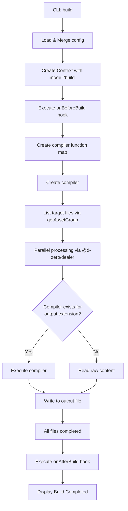
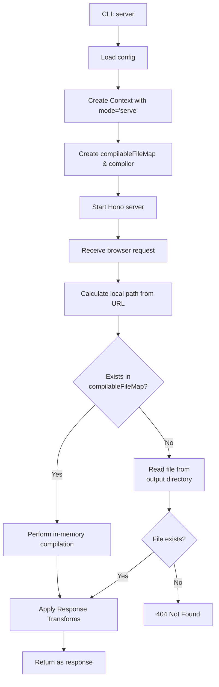

# 🏗️ Kamado Internal Architecture

Kamado is a static site generator that "bakes your HTML hard" on demand.
This document explains Kamado's internal structure, the flow from CLI to build/server execution, and the plugin system, primarily for contributors.

## Core Concepts

1.  **On-demand Compilation (Dev Server)**:
    The development server compiles and serves only the necessary files at the moment a request is made. This ensures fast startup even for large projects.
2.  **Plugin-based Compilers**:
    Each file format (HTML, CSS, JavaScript, etc.) is handled by an independent "compiler" plugin.
3.  **No Runtime**:
    The generated output does not include any proprietary Kamado client-side runtime.
4.  **Config vs Context**:
    Kamado separates user configuration (`Config`) from runtime execution context (`Context`). The `Context` type extends `Config` and adds a `mode` field (`'build' | 'serve'`) that is set by CLI commands at runtime. This allows compilers and hooks to detect whether they are running in build mode or dev server mode.

---

## Config vs Context

### Config

`Config` represents the user-provided configuration from `kamado.config.ts`. It includes:

- Directory settings (`dir.input`, `dir.output`)
- Dev server settings (`devServer.host`, `devServer.port`)
- Package.json information (`pkg.production.baseURL`, etc.)
- Compiler plugins
- Lifecycle hooks

### Context

`Context` extends `Config` and adds runtime execution information:

```typescript
export interface Context<M extends MetaData> extends Config<M> {
	readonly mode: 'serve' | 'build';
}
```

The `mode` field is **not user-configurable**. It is automatically set by the CLI command:

- `kamado build` → `mode: 'build'`
- `kamado server` → `mode: 'serve'`

### Mode Propagation

The execution mode flows through the system as follows:

1. **CLI** (`src/cli.ts`): User runs `kamado build` or `kamado server`
2. **Builder/Server** (`src/builder/build.ts` or `src/server/app.ts`): Creates `Context` by spreading `Config` and adding `mode`
3. **Compilers**: Receive `Context` instead of `Config`, allowing them to detect the execution mode
4. **Hooks**: Lifecycle hooks (`onBeforeBuild`, `onAfterBuild`) and page compiler transform functions receive the execution mode via `TransformContext`

This architecture enables mode-specific behavior, such as:

- Using dev server URLs in serve mode vs production URLs in build mode
- Different DOM manipulation behavior in hooks
- Conditional processing based on execution context

---

## Directory Structure

Key directories under `packages/kamado/src` and their roles:

- **`cli.ts`**: CLI entry point. Processes commands using `@d-zero/roar`.
- **`builder/`**: Execution logic for static builds (`kamado build`).
- **`server/`**: Logic for the development server (`kamado server`) using Hono.
- **`compiler/`**: Management of compiler plugin interfaces and the function map.
- **`config/`**: Loading and merging configuration files, defining default values, and providing the `defineConfig()` helper.
- **`data/`**: Listing files for compilation and managing asset groups.
- **`deprecated/`**: Deprecated internal utilities (not exported). Contains legacy code for backward compatibility.
- **`files/`**: File abstraction layer for reading files, processing Frontmatter, and managing cache.
- **`path/`**: Path resolution utilities.
- **`stdout/`**: Coloring and formatting for console output.

### Code Organization Principles

The codebase follows strict architectural rules for maintainability:

1. **One Function Per File**: Each TypeScript file (except test files) exports exactly one public function. This ensures clear responsibilities and easy navigation.

2. **Type Segregation**: Type definitions are consolidated in `types.ts` files within each directory category:
   - `compiler/types.ts`: All compiler-related interfaces
   - `config/types.ts`: Configuration-related types
   - `data/types.ts`: Data-related types
   - `files/types.ts`: File-related types
   - `path/types.ts`: Path-related types

3. **No Index Files**: `index.ts` files are not used. Instead, each module has a specifically named entry file (e.g., `compiler/compiler.ts`, `data/data.ts`, `config/config.ts`) that re-exports the module's public API. External packages use package-specific entry files (e.g., `page-compiler.ts`, `script-compiler.ts`).

4. **Naming Convention**: Function files are named after their exported function in kebab-case (e.g., `get-config.ts` exports `getConfig`, `create-compiler.ts` exports `createCompiler`). Module entry files are named after the module itself (e.g., `compiler.ts` for the compiler module, `page-compiler.ts` for the page compiler package).

This structure ensures code discoverability, prevents circular dependencies, and maintains a clean separation of concerns.

### 5. Function Signature Pattern

Functions with 2 or more required parameters should follow the context+options pattern:

```typescript
/**
 * @param context - Required dependencies and context (Required)
 * @param options - Optional settings and parameters (Partial, optional)
 */
export function functionName(
	context: Required<ContextType>,
	options?: Partial<OptionsType>,
): Promise<ReturnType>;
```

**Exception Cases** - Do NOT apply this pattern when:

1. **Only 1 required parameter**: Use the parameter directly

   ```typescript
   // ✅ Good
   export function filePathColorizer(rootDir: string, options?: Options);

   // ❌ Bad
   export function filePathColorizer(context: { rootDir: string }, options?: Options);
   ```

2. **All parameters are optional**: Keep as single parameter

   ```typescript
   // ✅ Good
   export function build(config?: BuildConfig);

   // ❌ Bad
   export function build(context: {}, options?: BuildConfig);
   ```

3. **Public API/builder functions**: Prioritize usability over consistency
   - Example: `createPageCompiler()(options)`, `createScriptCompiler()(options)`

4. **Functions receiving primitives**: Don't objectify
   - If already receives object → split into context+options
   - If receives primitives → keep as-is

**Judgment Criteria**:

- 2+ required parameters → Apply pattern
- All optional → Don't apply
- Public API → Don't apply (internal only)
- Already receives object → Split
- Receives primitives → Keep as-is

**Examples**:

```typescript
// ✅ Good: 3 required parameters
export function getAssetGroup(
	context: { inputDir: string; outputDir: string; compilerEntry: Compiler },
	options?: { glob?: string },
);

// ✅ Good: 1 required parameter
export function imageSizes(elements: Element[], options?: ImageSizesOptions);

// ❌ Bad: Wrapping single parameter
export function imageSizes(context: { elements: Element[] }, options?: ImageSizesOptions);
```

---

## Execution Flows

### 1. Build Flow (`kamado build`)

The flow for compiling all files at once and exporting them as static files.



### 2. Dev Server Flow (`kamado server`)

The flow for on-demand compilation during local development.



### CompilableFileMap

The `compilableFileMap` is a `Map<string, CompilableFile>` where keys are **output file paths** (destination paths in the output directory) and values are the corresponding source file objects. It is created by:

1. Iterating through all compiler entries in the configuration
2. For each compiler, using `getAssetGroup()` to collect files matching the compiler's `files` pattern (excluding those matching `ignore`)
3. Mapping each file's `outputPath` (the destination path) to the `CompilableFile` object

This map enables the dev server to:

- Quickly look up the source file when a request matches an output path
- Identify which compiler should be used based on the output extension
- Perform on-demand compilation without watching file changes

The map is built once at server startup and used for all subsequent requests.

---

## API and Extensibility

### Compiler Plugins

Kamado's features are extended by adding compiler plugins. All compiler-related types accept a generic `M extends MetaData` type parameter for type-safe custom metadata.

#### Compiler Configuration (`Compilers<M>`)

The `Config.compilers` field uses a callback form for type-safe compiler definition:

```typescript
export interface Compilers<M extends MetaData> {
	(define: CompilerDefine<M>): readonly CustomCompilerWithMetadata<M>[];
}

export type CompilerDefine<M extends MetaData> = <CustomCompileOptions>(
	factory: CustomCompilerFactory<M, CustomCompileOptions>,
	options?: CustomCompileOptions,
) => CustomCompilerWithMetadata<M>;

export type CustomCompilerFactory<M extends MetaData, CustomCompileOptions> = (
	options?: CustomCompileOptions,
) => CustomCompilerWithMetadata<M>;
```

The callback receives a `define` helper that binds compiler factories to options. The `M` type parameter flows from `defineConfig<M>` through the callback, enabling full type inference for each compiler's options.

At runtime, `createCompileFunctions()` (`src/compiler/compile-functions.ts`) resolves the callback by passing a helper that calls `factory(options)`.

#### Compiler Interfaces

```typescript
// CustomCompiler interface receives Context
export interface CustomCompiler<M extends MetaData> {
	(context: Context<M>): Promise<CustomCompileFunction> | CustomCompileFunction;
}

// CustomCompileFunction handles individual file compilation
export interface CustomCompileFunction {
	(
		compilableFile: CompilableFile,
		compile: CompileFunction,
		log?: (message: string) => void,
		cache?: boolean,
	): Promise<string | ArrayBuffer> | string | ArrayBuffer;
}
```

The `CustomCompiler` receives a `Context<M>` object (which includes `mode: 'serve' | 'build'`) and returns a `CustomCompileFunction`. The `CustomCompileFunction` receives:

- `compilableFile`: The file to compile
- `compile`: A recursive compile function that can compile other files during compilation (e.g., layouts, includes)
- `log`: Optional logging function
- `cache`: Whether to cache file content

The `CompilableFile` class (`src/files/`) handles file reading and cache management behind the scenes. The `compile` parameter enables compilers to recursively compile dependencies.

**Note**: Because `Context extends Config`, existing custom compilers that use `Config` as a parameter name will continue to work without changes. However, they can access `context.mode` to detect the execution mode.

### Page List Hook

The `pageList` hook allows users to filter or transform the list of pages available to templates. It is called during global data collection (in `getGlobalData()`) and affects the `pageList` variable available in page templates.

```typescript
pageList?: (
	pageAssetFiles: readonly CompilableFile[],
	config: Config<M>,
) => PageData<M>[] | Promise<PageData<M>[]>;
```

Where `PageData<M>` extends `CompilableFile` with optional `metaData`:

```typescript
interface PageData<M extends MetaData> extends CompilableFile {
	metaData?: M & { title?: string };
}
```

**Parameters:**

- `pageAssetFiles`: Array of all page files (files matching the page compiler's `files` pattern)
- `config`: Configuration object

**Returns:** Filtered/transformed array of `PageData<M>` objects

**Note:** At `pageList` hook time, `metaData` is not yet populated from frontmatter. If you need titles for breadcrumbs/navigation, explicitly set `metaData.title` in this hook.

**Use Cases:**

- Excluding draft or unpublished pages from navigation
- Sorting pages by date or custom order
- Adding custom metadata (like `metaData.title`) to pages
- Filtering pages by category or tag

**Example:**

```typescript
// kamado.config.ts
import { defineConfig } from 'kamado/config';

export default defineConfig({
	pageList: async (pages, config) => {
		// Exclude pages starting with underscore (drafts)
		return pages.filter((page) => !page.inputPath.includes('/_'));
	},
});
```

### Lifecycle Hooks

Users can insert custom logic before and after the build via `kamado.config.ts`.

- `onBeforeBuild(context: Context<M>)`: Executed before the build starts (e.g., preparing assets). Receives `Context` with `mode` field.
- `onAfterBuild(context: Context<M>)`: Executed after the build completes (e.g., generating sitemaps, notifications). Receives `Context` with `mode` field.

Both hooks receive `Context` instead of `Config`, allowing them to detect whether they are running in build or serve mode.

### Response Transform API

The Response Transform API allows modification of response content during development server mode (`serve` mode only). It is implemented in `src/server/transform.ts` and integrated into the request handling flow in `src/server/route.ts`.

**Note:** Both Response Transform API (`devServer.transforms`) and page compiler's Transform Pipeline API (`createPageCompiler()({ transforms })`) use the same `Transform` interface from `kamado/config`. However, they differ in scope:

- Response transforms apply to all file types in dev mode only, and respect the `filter` option
- Page transforms apply to HTML pages in both build and serve modes, and ignore the `filter` option

See `@kamado-io/page-compiler` for the page transform system, which includes `createDefaultPageTransforms()` (exported from `packages/@kamado-io/page-compiler/src/page-transform.ts`).

#### Architecture

```typescript
// Transform interface
export interface Transform<M extends MetaData> {
	readonly name: string;
	readonly filter?: {
		readonly include?: string | readonly string[];
		readonly exclude?: string | readonly string[];
	};
	readonly transform: (
		content: string | ArrayBuffer,
		context: TransformContext<M>,
	) => Promise<string | ArrayBuffer> | string | ArrayBuffer;
}

// Transform context provides request/response information
export interface TransformContext<M extends MetaData> {
	readonly path: string; // Request path (relative to output directory)
	readonly inputPath?: string; // Source file path (if available from compiler)
	readonly outputPath: string; // Output file path
	readonly outputDir: string; // Output directory path
	readonly isServe: boolean; // Whether running in development server mode
	readonly context: Context<M>; // Full execution context (config + mode)
	readonly compile: CompileFunction; // Function to compile other files
}
```

#### Execution Flow

1. **Mode Check**: Only executes in `serve` mode for `devServer.transforms` (checked in `applyTransforms()`)
2. **Filter Matching**: For each transform, checks path patterns using picomatch (glob pattern matching)
3. **Sequential Execution**: Transforms are applied in array order
4. **Error Handling**: Errors are logged but don't break the server; original content is returned on error

**Note**: Transform utilities (`injectToHead`, `createSSIShim`) can be used in both serve and build modes when called manually within page compiler custom transforms or `manipulateDOM()` hook option.

#### Implementation Details

**Location**: `src/server/transform.ts`

Key functions:

- `applyTransforms(content, context, transforms)`: Main execution engine
- `shouldApplyTransform(transform, context)`: Filter matching logic

**Integration**: `src/server/route.ts`

The transform is applied at two points in the request handler:

1. After compiling files matched in `compilableFileMap`
2. After reading static files from the output directory

A helper function `respondWithTransform()` consolidates the transform application logic.

#### Performance Characteristics

- **Minimal Overhead**: Only executes when transforms are configured
- **Streaming-Compatible**: Works with both string and ArrayBuffer content
- **Non-Blocking**: Async transforms are supported via `Promise.resolve()`
- **Fail-Safe**: Individual transform errors don't affect other transforms or the server

#### Use Cases

- **Development Tools**: Inject live reload scripts, debug panels
- **Pseudo-SSI**: Server-side includes for development
- **Header Injection**: Add meta tags, CSP headers (as comments)
- **Source Mapping**: Add source file comments to compiled outputs
- **Mock Data**: Inject test data into API responses

**Note**: This API is intentionally development-only. For production transformations, use the page compiler's Transform Pipeline (configure `transforms` option with transform factories like `manipulateDOM()`, `characterEntities()`, `prettier()`, etc.) or build-time processing.

---

## Main Dependencies

- **[@d-zero/dealer](https://www.npmjs.com/package/@d-zero/dealer)**: Controls parallel processing and progress display.
- **[@d-zero/roar](https://www.npmjs.com/package/@d-zero/roar)**: CLI command and option parsing.
- **[Hono](https://hono.dev/)**: The foundation for the high-performance dev server.
- **[cosmiconfig](https://github.com/cosmiconfig/cosmiconfig)**: Configuration file discovery.
