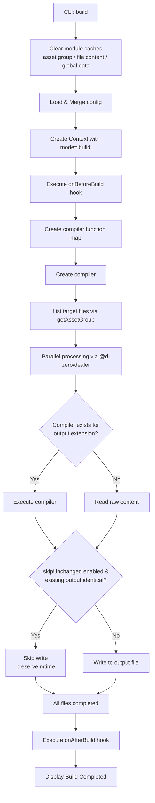
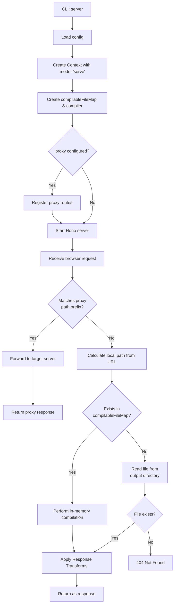

# 🏗️ Kamado Internal Architecture

Kamado is a static site generator that "bakes your HTML hard" on demand.
This document explains Kamado's internal structure, the flow from CLI to build/server execution, and the plugin system, primarily for contributors.

## Core Concepts

1.  **On-demand Compilation (Dev Server)**:
    The development server compiles and serves only the necessary files at the moment a request is made. This ensures fast startup even for large projects.
2.  **Plugin-based Compilers**:
    Each file format (HTML, CSS, JavaScript, etc.) is handled by an independent "compiler" plugin.
3.  **No Runtime**:
    The generated output does not include any proprietary Kamado client-side runtime.
4.  **Config vs Context**:
    Kamado separates user configuration (`Config`) from runtime execution context (`Context`). The `Context` type extends `Config` and adds a `mode` field (`'build' | 'serve'`) that is set by CLI commands at runtime. This allows compilers and hooks to detect whether they are running in build mode or dev server mode.

---

## Config vs Context

### Config

`Config` represents the user-provided configuration from `kamado.config.ts`. It includes:

- Directory settings (`dir.input`, `dir.output`)
- Dev server settings (`devServer.host`, `devServer.port`)
- Package.json information (`pkg.production.baseURL`, etc.)
- Compiler plugins
- Lifecycle hooks

### Context

`Context` extends `Config` and adds runtime execution information:

```typescript
export interface Context<M extends MetaData> extends Config<M> {
	readonly mode: 'serve' | 'build';
}
```

The `mode` field is **not user-configurable**. It is automatically set by the CLI command:

- `kamado build` → `mode: 'build'`
- `kamado server` → `mode: 'serve'`

### Mode Propagation

The execution mode flows through the system as follows:

1. **CLI** (`src/cli.ts`): User runs `kamado build` or `kamado server`
2. **Builder/Server** (`src/builder/build.ts` or `src/server/app.ts`): Creates `Context` by spreading `Config` and adding `mode`
3. **Compilers**: Receive `Context` instead of `Config`, allowing them to detect the execution mode
4. **Hooks**: Lifecycle hooks (`onBeforeBuild`, `onAfterBuild`) and page compiler transform functions receive the execution mode via `TransformContext`

This architecture enables mode-specific behavior, such as:

- Using dev server URLs in serve mode vs production URLs in build mode
- Different DOM manipulation behavior in hooks
- Conditional processing based on execution context

---

## Directory Structure

Key directories under `packages/kamado/src` and their roles:

- **`cli.ts`**: CLI entry point. Processes commands using `@d-zero/roar`.
- **`builder/`**: Execution logic for static builds (`kamado build`).
- **`server/`**: Logic for the development server (`kamado server`) using Hono. Includes proxy forwarding (`proxy.ts`), response transforms (`transform.ts`), and route handling (`route.ts`).
- **`compiler/`**: Management of compiler plugin interfaces and the function map.
- **`config/`**: Loading and merging configuration files, defining default values, and providing the `defineConfig()` helper.
- **`data/`**: Listing files for compilation and managing asset groups.
- **`deprecated/`**: Deprecated internal utilities (not exported). Contains legacy code for backward compatibility.
- **`files/`**: File abstraction layer for reading files, processing Frontmatter, and managing cache.
- **`path/`**: Path resolution utilities.
- **`stdout/`**: Coloring and formatting for console output.

### Code Organization Principles

The codebase follows strict architectural rules for maintainability:

1. **One Function Per File**: Each TypeScript file (except test files) exports exactly one public function. This ensures clear responsibilities and easy navigation.

2. **Type Segregation**: Type definitions are consolidated in `types.ts` files within each directory category:
   - `compiler/types.ts`: All compiler-related interfaces
   - `config/types.ts`: Configuration-related types
   - `data/types.ts`: Data-related types
   - `files/types.ts`: File-related types
   - `path/types.ts`: Path-related types

3. **No Index Files**: `index.ts` files are not used. Instead, each module has a specifically named entry file (e.g., `compiler/compiler.ts`, `data/data.ts`, `config/config.ts`) that re-exports the module's public API. External packages use package-specific entry files (e.g., `page-compiler.ts`, `script-compiler.ts`).

4. **Naming Convention**: Function files are named after their exported function in kebab-case (e.g., `get-config.ts` exports `getConfig`, `create-compiler.ts` exports `createCompiler`). Module entry files are named after the module itself (e.g., `compiler.ts` for the compiler module, `page-compiler.ts` for the page compiler package).

This structure ensures code discoverability, prevents circular dependencies, and maintains a clean separation of concerns.

### 5. Function Signature Pattern

Functions with 2 or more required parameters should follow the context+options pattern:

```typescript
/**
 * @param context - Required dependencies and context (Required)
 * @param options - Optional settings and parameters (Partial, optional)
 */
export function functionName(
	context: Required<ContextType>,
	options?: Partial<OptionsType>,
): Promise<ReturnType>;
```

**Exception Cases** - Do NOT apply this pattern when:

1. **Only 1 required parameter**: Use the parameter directly

   ```typescript
   // ✅ Good
   export function filePathColorizer(rootDir: string, options?: Options);

   // ❌ Bad
   export function filePathColorizer(context: { rootDir: string }, options?: Options);
   ```

2. **All parameters are optional**: Keep as single parameter

   ```typescript
   // ✅ Good
   export function build(config?: BuildConfig);

   // ❌ Bad
   export function build(context: {}, options?: BuildConfig);
   ```

3. **Public API/builder functions**: Prioritize usability over consistency
   - Example: `createPageCompiler()(options)`, `createScriptCompiler()(options)`

4. **Functions receiving primitives**: Don't objectify
   - If already receives object → split into context+options
   - If receives primitives → keep as-is

**Judgment Criteria**:

- 2+ required parameters → Apply pattern
- All optional → Don't apply
- Public API → Don't apply (internal only)
- Already receives object → Split
- Receives primitives → Keep as-is

**Examples**:

```typescript
// ✅ Good: 3 required parameters
export function getAssetGroup(
	context: { inputDir: string; outputDir: string; compilerEntry: Compiler },
	options?: { glob?: string },
);

// ✅ Good: 1 required parameter
export function imageSizes(elements: Element[], options?: ImageSizesOptions);

// ❌ Bad: Wrapping single parameter
export function imageSizes(context: { elements: Element[] }, options?: ImageSizesOptions);
```

---

## Execution Flows

### 1. Build Flow (`kamado build`)

The flow for compiling all files at once and exporting them as static files.


```mermaid
graph TD
    A[CLI: build] --> A2[Clear module caches<br>asset group / file content / global data]
    A2 --> B[Load & Merge config]
    B --> B2[Create Context with mode='build']
    B2 --> C[Execute onBeforeBuild hook]
    C --> D[Create compiler function map]
    D --> D2[Create compiler]
    D2 --> E[List target files via getAssetGroup]
    E --> F[Parallel processing via @d-zero/dealer]
    F --> G{Compiler exists for<br>output extension?}
    G -- Yes --> H[Execute compiler]
    G -- No --> I[Read raw content]
    H --> J{skipUnchanged enabled &<br>existing output identical?}
    I --> J
    J -- Yes --> J2[Skip write<br>preserve mtime]
    J -- No --> J3[Write to output file]
    J2 --> K[All files completed]
    J3 --> K
    K --> L[Execute onAfterBuild hook]
    L --> M[Display Build Completed]
```

Every `build()` invocation starts from a clean slate: the module-level caches (asset group memoization, file contents, global data) are cleared first, so source edits between consecutive builds in the same process are always reflected. Output directories are created lazily and deduplicated within a build, and with the `skipUnchanged` build option (`kamado build --skip-unchanged`) an output whose content is unchanged is not rewritten — the file size is compared first (via `stat`), then the content, and the existing file's mtime is preserved on a match.

#### Incremental builds (`--incremental`)

With `kamado build --incremental`, each output gets a **verifying trace** persisted in `.kamado/cache/build-manifest.json` (`src/builder/build-manifest.ts`): the input path, the SHA-256 of every file the compilation read, an environment digest, and the output's byte length. On the next incremental build, a file whose environment digest, input path, every dependency hash, and output size all still match is skipped entirely — the compiler never runs (`Cached`). Any mismatch falls through to a normal compile, which records a fresh trace, so a change that alters the dependency set itself is picked up on that rebuild (the classic verifying-trace property).

Dependency discovery has two layers:

- **Core read tracking** — `build()` wraps each compilation in `collectDependencies()` (`src/files/dependency-tracker.ts`, an `AsyncLocalStorage` scope). Every `getFileContent()` call inside that scope records its path, which automatically covers the page source, its sidecar JSON (including a probe of a _missing_ sidecar — creating it later invalidates the entry), and the layout file. Outside a collection scope the tracker is a no-op, so the dev server pays nothing.
- **Compiler-reported inputs** — resolution that happens outside kamado's file APIs is reported explicitly via `trackDependency()`: pug includes/extends (from the compiled template's `dependencies` list), esbuild's `metafile.inputs`, and postcss `dependency` messages (`@import`s).

The **environment digest** covers context-level inputs that affect every file of a compiler: each compile function may expose a `cacheDigest()` property (the page compiler digests global data and the page list — with the build-timestamp `date` excluded and functions omitted via `stableSerialize()`; the style/script compilers digest their options and resolved banner), and `build()` mixes in the config file's content hash when the CLI provides the config path. Cross-page dependencies (nav, breadcrumbs) flow through the page list, so a frontmatter change surfaced by `config.pageList` rebuilds every page, while a body-only edit rebuilds just that page.

Safety boundaries: entries with no recorded dependencies are never skipped (a custom compiler reading the filesystem directly gives nothing to verify against); a manifest with a different `BUILD_MANIFEST_VERSION` or unparsable content is ignored, which simply means a full rebuild; behavior changes hidden inside user functions outside the config file require deleting `.kamado/cache/` (documented in the README).

### 2. Dev Server Flow (`kamado server`)

The flow for on-demand compilation during local development.


```mermaid
graph TD
    A[CLI: server] --> B[Load config]
    B --> B2[Create Context with mode='serve']
    B2 --> C[Create compilableFileMap & compiler]
    C --> C1{proxy configured?}
    C1 -- Yes --> C1a[Register proxy routes]
    C1a --> C2[Start Hono server]
    C1 -- No --> C2
    C2 --> D[Receive browser request]
    D --> D1{Matches proxy<br>path prefix?}
    D1 -- Yes --> D2[Forward to target server]
    D2 --> D3[Return proxy response]
    D1 -- No --> E[Calculate local path from URL]
    E --> F{Exists in<br>compilableFileMap?}
    F -- Yes --> H[Perform in-memory compilation]
    H --> I[Apply Response Transforms]
    I --> J[Return as response]
    F -- No --> K[Read file from<br>output directory]
    K --> L{File exists?}
    L -- Yes --> I
    L -- No --> M[404 Not Found]
```

### CompilableFileMap

The `compilableFileMap` is a `Map<string, CompilableFile>` where keys are **output file paths** (destination paths in the output directory) and values are the corresponding source file objects. It is created by:

1. Iterating through all compiler entries in the configuration
2. For each compiler, using `getAssetGroup()` to collect files matching the compiler's `files` pattern (excluding those matching `ignore`)
3. Mapping each file's `outputPath` (the destination path) to the `CompilableFile` object

This map enables the dev server to:

- Quickly look up the source file when a request matches an output path
- Identify which compiler should be used based on the output extension
- Perform on-demand compilation without watching file changes

The map is built once at server startup and used for all subsequent requests.

### Output-Path Override via `outputPathField`

Compiler entries may opt in to frontmatter-driven output-path overrides by setting `outputPathField: '<field-name>'` on `CustomCompilerWithMetadata` (or via the user-facing compiler options). The factory result may also expose `defaultOutputPathField`, but the page compiler intentionally leaves it undefined — users opt in explicitly by passing `outputPathField: 'path'` (or another name) to `createPageCompiler()`. The default for every compiler is **off**, so existing projects' frontmatter keys are never reinterpreted as routing.

When the field is configured, `getAssetGroup()` reads each matched file's frontmatter (and JSON sidecar) before returning. If the resolved value is a non-empty string, the file's `outputPath`, `url`, `filePathStem`, and `fileSlug` are recomputed from that override via `resolveMetaPath()` (`packages/kamado/src/path/resolve-meta-path.ts`). Non-string values (numbers, arrays, objects, null) are ignored.

Three forms are accepted: `/foo/bar.html` (used as-is), `/foo/bar` (compiler's `outputExtension` is appended), and `/foo/bar/` (treated as a directory; `index<outputExtension>` is appended). Both `.` and `..` segments are rejected, and a final guard rejects any path that resolves outside `dir.output`.

When two source files resolve to the same output path, the compiler entry's `outputPathConflict` setting decides the reaction: `'error'` (throw), `'warning'` (default — log to `stderr` and pick a winner), or `'silent'` (pick a winner with no log). Winner selection rules: a file whose `outputPath` came from the frontmatter override beats one using the default computed path; among ties the first-seen file wins. The map of seen output paths is built in `getAssetGroup()` and replacement is order-independent because the surviving entry's position in the Map (and therefore in the returned `CompilableFile[]`) is the first-seen position.

The eager read warms the module-level cache in `files/file-content.ts`, so the build's later `getContentFromFile` call (with `cache=true`) does not re-read from disk. In addition, `getAssetGroup()` results themselves are memoized by the enumeration's value-inputs (cleared at the start of every build), so the same compiler entry enumerated by both `build()` and `getGlobalData()` pays the glob + frontmatter pass only once. The dev server's per-request compile passes `cache=false` to pick up edits, so the eager read is paid only once at startup. Because the override is reflected in the `CompilableFile` returned by `getAssetGroup`, both `compilableFileMap` (dev server) and `build()` (which writes to `file.outputPath`) honor the override with no further changes.

---

## API and Extensibility

### Compiler Plugins

Kamado's features are extended by adding compiler plugins. All compiler-related types accept a generic `M extends MetaData` type parameter for type-safe custom metadata.

#### The `MetaData` Base Interface

`MetaData` is an empty base interface (`{}`) for page metadata. Any user-defined `interface` or `type` satisfies the `extends MetaData` constraint.

#### `Config<M>` Invariance

`Config<M>` is **invariant** in its type parameter `M`. This is an inherent property of TypeScript's type system and cannot be avoided, because `M` appears in both covariant and contravariant positions:

**Contravariant positions** (callback parameters where `M` flows in):

- `pageList: (pageAssetFiles, config: Config<M>) => PageData<M>[]`
- `onBeforeBuild: (context: Context<M>) => ...`
- `onAfterBuild: (context: Context<M>) => ...`
- `compilers: (def: CompilerDefine<M>) => ...`
- `devServer.transforms[].transform: (content, context: TransformContext<M>) => ...`

**Covariant positions** (return types where `M` flows out):

- `pageList: (...) => PageData<M>[]`

Additionally, `Context<M> extends Config<M>` creates a recursive invariance chain.

**Consequence:** `Config<PageMetaData>` is **never** assignable to `Config<MetaData>` (or vice versa). Functions that accept a `Config` should be made generic:

```typescript
// ✅ Good — works with any metadata type
function helper<M extends MetaData>(config: Config<M>) { ... }

// ❌ Bad — Config<PageMetaData> is NOT assignable to Config<MetaData>
function helper(config: Config<MetaData>) { ... }
```

#### Generic Type Parameter (`M extends MetaData`)

The type parameter `M` propagates through the entire type system:

```
defineConfig<M>() → Config<M> → Context<M> → TransformContext<M>
                                            → PageData<M>
                                            → CompileData<M> → NavNode<M>
```

**Types with defaults (`= MetaData`):**

User-facing types that appear in type annotations have a default: `Config`, `Context`, `UserConfig`, `Transform`, `TransformContext`, `PageData`, `GlobalData`. This means users who don't need custom metadata can write `Config` instead of `Config<MetaData>`.

**Types without defaults:**

Compiler-related types (`CustomCompiler`, `CustomCompilerPlugin`, `CustomCompilerWithMetadata`, `CompilerDefine`, `CustomCompilerFactory`, `CustomCompilerFactoryResult`, `Compilers`, `CompilerContext`) and page-compiler types (`PageCompilerOptions`, `CompileData`, `CompileHooks`, `NavNode`, etc.) do **not** have defaults. This is intentional — if a 3rd-party compiler author omits `<M>`, TypeScript reports an error rather than silently defaulting to the base `MetaData`, which could cause type mismatches at integration time.

**Why functions don't need defaults:**

Functions like `defineConfig<M>()` and `createPageCompiler<M>()` infer `M` from their arguments. Adding a default to function type parameters would hide type errors rather than surfacing them.

**The `CompilerDefine` pattern:**

The `compilers` callback receives a `def: CompilerDefine<M>` helper. `CompilerDefine<M>` is a generic function that infers `CustomCompileOptions` from the factory's return type:

```typescript
type CompilerDefine<M extends MetaData> = <CustomCompileOptions>(
	factory: CustomCompilerFactory<M, CustomCompileOptions>,
	options?: CustomCompileOptions,
) => CustomCompilerWithMetadata<M>;
```

This two-level generic (`M` from config, `CustomCompileOptions` from factory) allows each `def()` call to have fully inferred option types without manual annotation.

#### Compiler Configuration (`Compilers<M>`)

The `Config.compilers` field uses a callback form for type-safe compiler definition:

```typescript
export interface Compilers<M extends MetaData> {
	(define: CompilerDefine<M>): readonly CustomCompilerWithMetadata<M>[];
}

export type CompilerDefine<M extends MetaData> = <CustomCompileOptions>(
	factory: CustomCompilerFactory<M, CustomCompileOptions>,
	options?: CustomCompileOptions,
) => CustomCompilerWithMetadata<M>;

export type CustomCompilerFactory<M extends MetaData, CustomCompileOptions> = (
	options?: CustomCompileOptions,
) => CustomCompilerWithMetadata<M>;
```

The callback receives a `define` helper that binds compiler factories to options. The `M` type parameter flows from `defineConfig<M>` through the callback, enabling full type inference for each compiler's options.

At runtime, `createCompileFunctions()` (`src/compiler/compile-functions.ts`) resolves the callback by passing a helper that calls `factory(options)`.

#### Compiler Interfaces

```typescript
// CustomCompiler interface receives Context
export interface CustomCompiler<M extends MetaData> {
	(context: Context<M>): Promise<CustomCompileFunction> | CustomCompileFunction;
}

// CustomCompileFunction handles individual file compilation
export interface CustomCompileFunction {
	(
		compilableFile: CompilableFile,
		compile: CompileFunction,
		log?: (message: string) => void,
		cache?: boolean,
	): Promise<string | ArrayBuffer> | string | ArrayBuffer;
}
```

The `CustomCompiler` receives a `Context<M>` object (which includes `mode: 'serve' | 'build'`) and returns a `CustomCompileFunction`. The `CustomCompileFunction` receives:

- `compilableFile`: The file to compile
- `compile`: A recursive compile function that can compile other files during compilation (e.g., layouts, includes)
- `log`: Optional logging function
- `cache`: Whether cached file contents and compiled artifacts (e.g. compiled template functions, processors) may be reused. The dev server passes `false` on every request so that file edits are always reflected; `build()` leaves it `undefined` (compilers default to caching)

The `CompilableFile` class (`src/files/`) handles file reading and cache management behind the scenes. The `compile` parameter enables compilers to recursively compile dependencies.

**Note**: Because `Context extends Config`, existing custom compilers that use `Config` as a parameter name will continue to work without changes. However, they can access `context.mode` to detect the execution mode.

### Page List Hook

The `pageList` hook allows users to filter or transform the list of pages available to templates. It is called during global data collection (in `getGlobalData()`) and affects the `pageList` variable available in page templates.

```typescript
pageList?: (
	pageAssetFiles: readonly CompilableFile[],
	config: Config<M>,
) => PageData<M>[] | Promise<PageData<M>[]>;
```

Where `PageData<M>` extends `CompilableFile` with optional `metaData`:

```typescript
interface PageData<M extends MetaData> extends CompilableFile {
	metaData?: M;
}
```

**Parameters:**

- `pageAssetFiles`: Array of all page files (files matching the page compiler's `files` pattern)
- `config`: Configuration object

**Returns:** Filtered/transformed array of `PageData<M>` objects

**Note:** At `pageList` hook time, `metaData` is not yet populated from frontmatter. If you need titles for breadcrumbs/navigation, explicitly set `metaData.title` in this hook.

**Use Cases:**

- Excluding draft or unpublished pages from navigation
- Sorting pages by date or custom order
- Adding custom metadata (like `metaData.title`) to pages
- Filtering pages by category or tag

**Example:**

```typescript
// kamado.config.ts
import { defineConfig } from 'kamado/config';

export default defineConfig({
	pageList: async (pages, config) => {
		// Exclude pages starting with underscore (drafts)
		return pages.filter((page) => !page.inputPath.includes('/_'));
	},
});
```

### Lifecycle Hooks

Users can insert custom logic before and after the build via `kamado.config.ts`.

- `onBeforeBuild(context: Context<M>)`: Executed before the build starts (e.g., preparing assets). Receives `Context` with `mode` field.
- `onAfterBuild(context: Context<M>)`: Executed after the build completes (e.g., generating sitemaps, notifications). Receives `Context` with `mode` field.

Both hooks receive `Context` instead of `Config`, allowing them to detect whether they are running in build or serve mode.

### Response Transform API

The Response Transform API allows modification of response content during development server mode (`serve` mode only). It is implemented in `src/server/transform.ts` and integrated into the request handling flow in `src/server/route.ts`.

**Note:** Both Response Transform API (`devServer.transforms`) and page compiler's Transform Pipeline API (`createPageCompiler()({ transforms })`) use the same `Transform` interface from `kamado/config`. However, they differ in scope:

- Response transforms apply to all file types in dev mode only, and respect the `filter` option
- Page transforms apply to HTML pages in both build and serve modes, and ignore the `filter` option

See `@kamado-io/page-compiler` for the page transform system, which includes `createDefaultPageTransforms()` (exported from `packages/@kamado-io/page-compiler/src/page-transform.ts`).

#### Architecture

```typescript
// Transform interface
export interface Transform<M extends MetaData> {
	readonly name: string;
	readonly filter?: {
		readonly include?: string | readonly string[];
		readonly exclude?: string | readonly string[];
	};
	readonly transform: (
		content: string | ArrayBuffer,
		context: TransformContext<M>,
	) => Promise<string | ArrayBuffer> | string | ArrayBuffer;
}

// Transform context provides request/response information
export interface TransformContext<M extends MetaData> {
	readonly path: string; // Request path (relative to output directory)
	readonly filePath: string; // File path (alias for path)
	readonly inputPath?: string; // Source file path (if available from compiler)
	readonly outputPath: string; // Output file path
	readonly outputDir: string; // Output directory path
	readonly isServe: boolean; // Whether running in development server mode
	readonly context: Context<M>; // Full execution context (config + mode)
	readonly compile: CompileFunction; // Function to compile other files
}
```

#### Execution Flow

1. **Mode Check**: Only executes in `serve` mode for `devServer.transforms` (checked in `applyTransforms()`)
2. **Filter Matching**: For each transform, checks path patterns using picomatch (glob pattern matching)
3. **Sequential Execution**: Transforms are applied in array order
4. **Error Handling**: Errors are logged but don't break the server; original content is returned on error

**Note**: Transform utilities (`injectToHead`, `createSSIShim`) can be used in both serve and build modes when called manually within page compiler custom transforms or `manipulateDOM()` hook option.

#### Implementation Details

**Location**: `src/server/transform.ts`

Key functions:

- `applyTransforms(content, context, transforms)`: Main execution engine
- `shouldApplyTransform(transform, context)`: Filter matching logic

**Integration**: `src/server/route.ts`

The transform is applied at two points in the request handler:

1. After compiling files matched in `compilableFileMap`
2. After reading static files from the output directory

A helper function `respondWithTransform()` consolidates the transform application logic.

#### Performance Characteristics

- **Minimal Overhead**: Only executes when transforms are configured
- **Streaming-Compatible**: Works with both string and ArrayBuffer content
- **Non-Blocking**: Async transforms are supported via `Promise.resolve()`
- **Fail-Safe**: Individual transform errors don't affect other transforms or the server

#### Use Cases

- **Development Tools**: Inject live reload scripts, debug panels
- **Pseudo-SSI**: Server-side includes for development
- **Header Injection**: Add meta tags, CSP headers (as comments)
- **Source Mapping**: Add source file comments to compiled outputs
- **Mock Data**: Inject test data into API responses

**Note**: This API is intentionally development-only. For production transformations, use the page compiler's Transform Pipeline (configure `transforms` option with transform factories like `manipulateDOM()`, `characterEntities()`, `prettier()`, etc.) or build-time processing.

### Proxy API

The Proxy API forwards requests matching configured path prefixes to external servers during development. It is implemented in `src/server/proxy.ts` and integrated into the Hono app in `src/server/app.ts`.

#### Architecture

```typescript
// Proxy rule configuration
export interface ProxyRule {
	readonly target: string; // Target URL to proxy to
	readonly pathRewrite?: (path: string) => string | Promise<string>; // Rewrite path before proxying
	readonly changeOrigin?: boolean; // Change Origin/Host headers (default: false)
}

// Configuration: Record<pathPrefix, ProxyRule | string>
// e.g., { '/api': 'https://backend.example.com' }
```

#### Execution Flow

1. **Route Registration**: `setProxyRoutes()` is called **before** `setRoute()` in `app.ts`, so proxy routes take priority over file-serving routes
2. **Path Sorting**: Entries are sorted by path prefix length (longest first) to ensure specific routes match before general ones
3. **Rule Normalization**: String shorthand values are normalized into `ProxyRule` objects via `normalizeRule()`
4. **Request Forwarding**: Uses native `fetch()` with manual header management. Request headers are forwarded; `Host`/`Origin` are optionally rewritten when `changeOrigin: true`
5. **Body Handling**: Request bodies are streamed for methods that carry a body (POST, PUT, PATCH, DELETE). GET and HEAD requests have no body
6. **Error Handling**: On proxy failure, a `502 Bad Gateway` response is returned and the error is logged to the console

#### Implementation Details

**Location**: `src/server/proxy.ts`

Key functions:

- `setProxyRoutes(app, proxyConfig)`: Registers proxy routes on the Hono app
- `normalizeRule(rule)`: Converts string shorthand to `ProxyRule` object
- `hasBody(method)`: Determines if an HTTP method carries a request body

**Integration**: `src/server/app.ts`

Proxy routes are registered conditionally — only when `context.devServer.proxy` is defined. Both `${pathPrefix}/*` and `${pathPrefix}` patterns are registered to handle nested and exact-match requests.

#### Design Decisions

- **Native `fetch()`**: Uses the runtime's built-in `fetch()` rather than an HTTP proxy library, keeping the dependency footprint minimal
- **`redirect: 'manual'`**: Preserves redirect responses from the target server instead of following them automatically
- **`duplex: 'half'`**: Enables streaming request bodies in Node.js `fetch()` implementation
- **No response transforms**: Proxy responses are returned as-is without passing through the Response Transform pipeline

---

## Caching Layers

Kamado uses several independent caches to avoid repeating per-file work. Contributors touching the build or compile pipeline should know their scopes and invalidation rules:

| Cache                       | Location                                       | Scope / Invalidation                                                                                                                                                                                                                                                   |
| --------------------------- | ---------------------------------------------- | ---------------------------------------------------------------------------------------------------------------------------------------------------------------------------------------------------------------------------------------------------------------------- |
| File contents               | `src/files/file-content.ts`                    | Module-level `Map`. Cleared at the start of every `build()` (`clearFileContentCache`). Bypassed per request in serve mode (`cache=false`).                                                                                                                             |
| Global data                 | `src/data/get-global-data.ts`                  | Module-level `Map` for data files. Cleared at the start of every `build()` (`clearGlobalDataCache`).                                                                                                                                                                   |
| Asset group memoization     | `src/data/get-asset-group.ts`                  | Module-level `Map` keyed by the enumeration's value-inputs. Lets `build()` and `getGlobalData()` share one glob + frontmatter pass. Cleared at the start of every `build()` (`clearAssetGroupCache`).                                                                  |
| Compiled template functions | `@kamado-io/pug-compiler` (`compile-pug.ts`)   | Per compiler instance, keyed by template source, bounded LRU. A fresh instance (and cache) is created each time the compile hooks factory is resolved — i.e. once per build/serve context. Skipped when `cache=false`.                                                 |
| PostCSS processor / banner  | `@kamado-io/style-compiler`, `script-compiler` | Lazily built once per context and reused across files. Rebuilt per compilation when `cache=false` (serve), so `postcss.config.js` edits and date-based banners stay fresh during development. A failed processor build is not cached, so the next compilation retries. |

Related to these caches, `compileHooks` and `transforms` factories on the page compiler are resolved **once per build/serve context** (in the compiler's context setup), not per file. Hook factories and transform instances are therefore shared across all pages of a build and across concurrent compilations.

The `cache` flag travels from `CustomCompileFunction` (4th parameter) through the page compiler's transpile layer into the compile hooks' `compiler` function (4th parameter), so template-engine packages can honor serve mode's no-cache semantics. `build()` leaves the flag `undefined`, which means caching is **enabled** — compilers must treat `undefined` the same as `true` and test for serve mode with `cache === false`, never with a truthiness check.

**Design note — two serve-mode signals.** Compilers currently receive "is this serve mode?" through two channels: the per-call `cache` flag (`false` in serve) and the context-level `context.mode` (used by, e.g., the `sourcemap: 'onServer'` option via `resolveSourcemapFlag`). Today the two always agree, but they are evaluated at different times (per compilation vs. per context). If a new mode or a "cache in serve" option is ever introduced, consolidate both into a single compile-context object instead of keeping the signals in sync manually.

---

## Benchmarking

A synthetic-build benchmark lives in `packages/kamado/benchmark/`:

```bash
yarn bench                 # 1000 pages, 3 runs, transforms disabled
yarn bench --pages=500     # page count
yarn bench --runs=5        # number of runs (median is reported)
yarn bench --full          # enable the default page transforms (jsdom/prettier/minifier)
yarn bench --incremental   # measure no-change incremental rebuilds (one unmeasured cold build seeds the manifest)
```

It generates a fixture site (N Pug pages sharing one layout with an include, plus a few CSS/TS files) under `packages/kamado/.bench/` and measures `build()` wall-clock time against the built `dist` output — run `yarn build` first. Use it to compare before/after numbers when changing the build pipeline; module-level caches are cleared between runs so every run measures a cold build (with `--incremental`, only the on-disk manifest carries over, matching what a fresh CLI process would see).

Reference numbers (13-inch MacBook Pro, M1): with `--full --pages=1000`, a cold build takes ~10 s and a no-change incremental rebuild ~0.24 s (≈40×).

---

## Main Dependencies

- **[@d-zero/dealer](https://www.npmjs.com/package/@d-zero/dealer)**: Controls parallel processing and progress display.
- **[@d-zero/roar](https://www.npmjs.com/package/@d-zero/roar)**: CLI command and option parsing.
- **[Hono](https://hono.dev/)**: The foundation for the high-performance dev server.
- **[cosmiconfig](https://github.com/cosmiconfig/cosmiconfig)**: Configuration file discovery.
